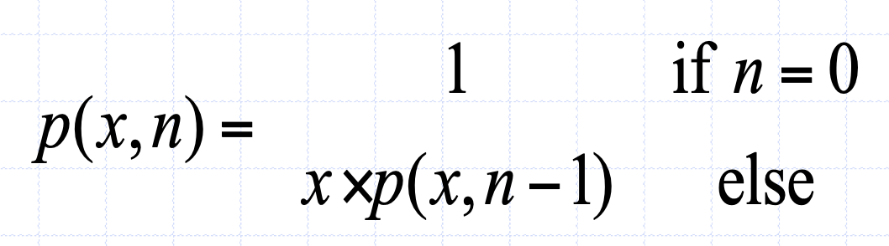
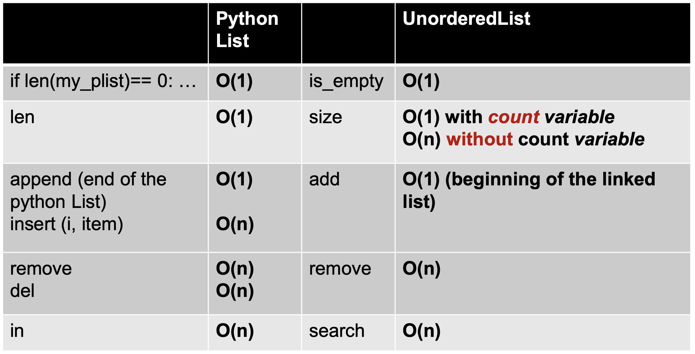

# Data Structure and Algorithm

## Practice
- [LeetCode](https://leetcode.com) 

## BigO
- worst case
- choose dominant terms 
- 
- 

## Algorithmn
### Recursive
- 4 Keys
  - How to define samller problem of same type
  - How can each call dinimish size
  - What case of problem can be base case
  - Can you reach base case
- Base Case
  - value for which perform no calls.
  - every recursive chain MUST reach base case.
- Recurvsive Call
  - each call solve an IDENTITICAL and SMALLER problem.
  - should be defined so that it towards base case, no problem smaller than base case is allowed.
- Vizualization: 
#### Binary Search
- 
- BigO logn : 

#### Type 
- Head Recursion: 
- Tail Recursion: 
- More : [geeksforgeeks types of recursions](https://www.geeksforgeeks.org/types-of-recursions/)

#### Fibonacci Sequence

```
def fibonacci(n):
    if n <= 0:
        return 0
    elif n == 1:
        return 1
    else:
        return fibonacci(n - 1) + fibonacci(n - 2)
```
- BigO : O(n) (make n recursive calls)


- BigO :
  - Time Complexity: O(n) (Cached) / O(n^2)
  - Space Complexity: O(n) (Cached) / O(n) (due to the recursion stack)
#### Power Function


- Intuition :
  -  b^100 = b^50 * b^50
  -  b^101 = b * b^50 * b^50
-  Definition :
   -  n = 0 -> b^n = 1  
   -  n > 0 && = even -> b^n/2 * b^n/2
   -  n > 0 && = odd -> b * b^n/2 * b^n/2
- Implementation :
  - recursive :
    ```
    def power(x, n):
        if n == 0:
            return 1  # Base case: x^0 = 1
        elif n < 0:
            return 1 / power(x, -n)  
        elif n % 2 == 0:
            half_power = power(x, n // 2)  
            return half_power * half_power  
            half_power = power(x, (n - 1) // 2)  
            return x * half_power * half_power  
    ```
  -  recursive simple :
        ```
        def power_recursive(x, n):
            if n == 0:
                return 1  # Base case: x^0 = 1
            elif n < 0:
                return 1 / power_recursive(x, -n) 
            else:
                return x * power_recursive(x, n - 1)
        ``` 
  - iterative  :
    ```
    def power_iterative(x, n):
        result = 1
        for _ in range(n):
            result *= x
        return result
    ```
    
- BigO :
  - Time Complexity: O(logn) / O(n) (re. simple) 
  - Space Complexity: O(logn) / O(n) (re. simple) / O(1) (iterative)

#### Hanoi Tower

```
def hanoi(n, source, target, auxiliary):
    if n == 1:
        print(f"Move disk 1 from {source} to {target}")
        return
    hanoi(n - 1, source, auxiliary, target)
    print(f"Move disk {n} from {source} to {target}")
    hanoi(n - 1, auxiliary, target, source)
```


- Step : 2^n - 1
- BigO : 
  - Time Complexity: O(2^n)
  - Space Complexity: O(n)


## Abstract Data Type
- collection of data
- set of operations on that data

### Linear 
- ordered
- can add or remove into particular position
#### Stack
- Last-in & First-out (LIFO) 
- Operations :
  - push(onTop)
  - pop(theFirst)
  - peek(theLast)
  - isEmpty()
  - size()
- Implementation :
    ```
    class Stack:
        def __init__(self):
            self.items = []

        def push(self, item):
            self.items.append(item)

        def pop(self):
            return self.items.pop() if self.items else None

        def peek(self):
            return self.items[-1] if self.items else None

        def is_empty(self):
            return len(self.items) == 0
    ```
- BigO :
  - push/pop :  O(1)
- 
- Application :
  - Checking for Balanced Braces
  - Bracket Matching 
  - Postfix Calcultion 


#### Queue
- ordered collection of items
- First-in, First-out (FIFO)
- Operations :
  - enqueue(toLast)
  - dequeue(theFirst)
  - peek()
  - isEmpty()
  - size()
- Implementation :
    ```
    class SimpleQueue:
        def __init__(self):
            self.queue = []

        def enqueue(self, item):
            self.queue.append(item)

        def dequeue(self):
            if not self.is_empty():
                return self.queue.pop(0)
            raise IndexError("Dequeue from empty queue")

        def is_empty(self):
            return len(self.queue) == 0

        def size(self):
            return len(self.queue)
    ``` 
- Hot Potato
 
    ```
    def hot_potato(players, num_passes):
        while len(players) > 1:
            for _ in range(num_passes):
                players.push(players.dequeue())  
            eliminated = players.dequeue()
        return players.peek()
    ```
- Circular Queue : 
  - 
  - 
  ```
  class CircularQueue:
    def __init__(self, size):
        self.size = size
        self.queue = [None] * size
        self.front = -1
        self.rear = -1

    def is_empty(self):
        return self.front == -1

    def is_full(self):
        return (self.rear + 1) % self.size == self.front

    def enqueue(self, item):
        if self.is_full():
            return
        if self.is_empty():
            self.front = 0
        self.rear = (self.rear + 1) % self.size
        self.queue[self.rear] = item

    def dequeue(self):
        if self.is_empty():
            print("Queue is empty!")
            return None
        item = self.queue[self.front]
        if self.front == self.rear:  # Queue has only one element
            self.front = -1
            self.rear = -1
        else:
            self.front = (self.front + 1) % self.size
        return item

    def peek(self):
        if self.is_empty():
            return None
        return self.queue[self.front]
  ```
- Round Robin Scheduler
   
    ```
    class Process:
        def __init__(self, name, burst_time):
            self.name = name
            self.burst_time = burst_time
            self.remaining_time = burst_time


    def round_robin(processes, time_quantum):
        # time quantum refers to the fixed amount of time that each process is allowed to run 
        time = 0
        # tracking execution time
        
        queue = CircularQueue(len(processes))
        for process in processes:
            queue.enqueue(process)

        while not queue.is_empty():
            current_process = queue.dequeue()
            if current_process.remaining_time > time_quantum:
                time += time_quantum
                # simulate execution for time_quantum
                current_process.remaining_time -= time_quantum 
                queue.enqueue(current_process)
            else:
                time += current_process.remaining_time
                # simulate finishing execution
                current_process.remaining_time = 0
    ```

#### Stack vs Queue

| Stack | Queue |
|----------|----------|
| LIFO    | FIFO   |
| Good for Py List    | Bad for Py List   |
| push(), pop(), peek() : O(1)    | enqueue()(Py List):O(n), enqueue()(Circular) dequeue(), peek() : O(1)   |


#### Deque
- ordered collection 
- added or removed on both front or back
- does not require LIFO or FIFO orderings
- 
- Operations :
  - add_front()
  - add_rear()
  - remove_front()
  - remove_rear()
  - isEmpty()
  - size()
- BigO :
  - front : O(1)
  - rear : O(n)
- Application :
  - Palindrome Checker :
    - radar
    - deed
    ```
    def is_palindrome(s):
        cleaned_str = ''.join(s.split()).lower()
        char_deque = deque(cleaned_str)

        while len(char_deque) > 1:
            if char_deque.remove_front() != char_deque.remove_rear():
                return False
        return True
    ```
#### Linked List
- Head = First Node
- Tail = Node with no next Node
- Reference variables can be used to implement the data structure known as a linked list
- Each reference in a linked list is a reference to the next node in the list
- Any element in a list can be accessed directly; however, you must traverse a linked list to access a particular node
- Items can be inserted into and deleted from a reference- based linked list without shifting data

- Operations:
  - add()
  - remove()
  - search()
  - is_empty()
  - size()

- Implementation :
    ``` 
    class Node:

    def __init__(self, init_data):
            self.data = init_data
            self.next = None
            
    def get_data(self): 
        return self.data
        
    def get_next(self):
        return self.next
        
        
    def set_data(self, new_data):
        self.data = newdata
        
    def set_next(self, new_next):
        self.next = new_next
    ```
- Node Insert :

    ```
    def insert(head, new_node, position):
    if position == 0:
        new_node.next = head
        return new_node
        
    current = head
    previous = None
    for i in range(position):
        if current is None:
            break
        previous = current
        current = current.next

    new_node.next = current
    previous.next = new_node
        
    return head
    ```
- Node Delete :

    ```
    def delete(head, value):
        if head is None:
            return head
        
        if head.value == value:
            return head.next
        
        current = head
        
        while current.next is not None:
            if current.next.value == value:
                current.next = current.next.next
                return head
            current = current.next
        
        return head
    ```
- Traversal :
    ```
    curr = self.head
    while curr != None:
    print(curr.get_data())
    curr = curr.get_next()
    ```

- Node Search :
    ```
    curr = self.head
    while curr != None:
    if curr.get_data() == item: 
        return True
    else:
        curr = curr.get_next()
    return False
    ```

- Size :
    ```
    def size():
        curr = self.head
        count = 0
        while curr != None:
            count = count + 1
            curr = curr.get_next()
        return count
        
    # cached
    def __init__():
        self.count = 0
        
    def insert/delete()
        .....
        self.count++/--
    ```

- BigO :



- Ordered List :
- Implementation :
    ```
    def insert(self, item):
        new_node = Node(item)
        current = self.head
        previous = None
        stop = False

        while current is not None and not stop:
            if current.get_data() > item:
                stop = True
            else:
                previous = current
                current = current.get_next()
        
        if previous is None:  # Insert at the head
            new_node.set_next(self.head)
            self.head = new_node
        else:  # Insert in the middle or end
            new_node.set_next(current)
            previous.set_next(new_node
        
    def search(self, item):
        current = self.head
        while current is not None:
            if current.get_data() == item:
                return True
            elif current.get_data() > item:
                return False
            current = current.get_next()
        return False
    ```


- Unordered vs Ordered :
  - Sorted in terms of characteristics
  - add != insert  

##### Singly Linked List
  - Head, also Tail referencing to last Node
  - Useful for queue-like structure, e.g. a waiting list

- Implementation : 
    ```
    def add_to_tail(node):
        if count <= 0:
            self.head = node
            self.tail = node
        else:
            self.tail.next = node
            self.tail = node
        
        self.count += 1
        
    def remove_tail():    
        prev = self.head
        while (prev.get_next() != self.tail):
            prev = prev.get_next()
        prev.set_next(None)
        self.tail = prev
        self.count -= 1
        
    def remove_head():
        self.head = self.head.get_next()
        if self.head == None:
            self.tail = None
        self.count -= 1
    ```
- BigO : 
  


##### Doubly Linked List
- data
- prev node
- next node

- Operations :
    

- Implementation :
  - insert:
    - case1 : empty list
    - case2 : at the beginning of the list
    - case3 : at the end of the list
  ```
    class NodeDLL:
        def __init__(self, init_data, next_node=None, prev_node=None):
            self.data = init_data
            self.next = next_node
            self.prev = prev_node

        def get_data(self):
            return self.data

        def get_prev(self):
            return self.prev

        def get_next(self):
            return self.next

        def set_data(self, new_data):
            self.data = new_data

        def set_next(self, new_next):
            self.next = new_next

        def set_prev(self, new_prev):
            self.prev = new_prev


    class DoublyLinkedList:
        def __init__(self):
            self.head = None
            self.tail = None

        def append(self, new_data):
            new_node = NodeDLL(new_data)
            if not self.head:
                self.head = new_node
                self.tail = new_node
            else:
                self.tail.set_next(new_node)
                new_node.set_prev(self.tail)
                self.tail = new_node

        def prepend(self, new_data):
            new_node = NodeDLL(new_data)
            if not self.head:
                self.head = new_node
                self.tail = new_node
            else:
                new_node.set_next(self.head)
                self.head.set_prev(new_node)
                self.head = new_node

        def delete(self, node):
            if not node:
                return
            if node == self.head:
                self.head = node.get_next()
                if self.head:
                    self.head.set_prev(None)
            elif node == self.tail:
                self.tail = node.get_prev()
                if self.tail:
                    self.tail.set_next(None)
            else:
                prev_node = node.get_prev()
                next_node = node.get_next()
                if prev_node:
                    prev_node.set_next(next_node)
                if next_node:
                    next_node.set_prev(prev_node)

        def display_forward(self):
            current = self.head
            while current:
                print(current.get_data(), end=' ')
                current = current.get_next()
            print()

        def display_backward(self):
            current = self.tail
            while current:
                print(current.get_data(), end=' ')
                current = current.get_prev()
            print()
    ```

##### Circular Doubly Linked List
- dummy head
- prev node of dummy head = last node
- next of the last node 
- Structure :
    
    
    
    
- BigO :
  

##### Circular Doubly Linked List Without Dummy
- less one node, bit more memory and simpler
- but insert/remove on empty must be careful


#### Sorting
- compare function:
  ```
    def cmp(a, b):
        if a > b:
            t = a
            a = b
            b = t
        return a, b
  ```
##### Bubble Sort

  -  Number of pass-throughs (steps) = number of elements - 1 
  -  After m iterations, the rightmost m elements are sorted into their correct place
  - Largest elements tend to ‘bubble-up’ to the right
  - Implementation :
    ```
    def bubble_sort(arr):
        n = len(arr)
        for i in range(n):
            for j in range(0, n-i-1):
                arr[j], arr[j+1] = cmp(arr[j],arr[j+1])
        return arr
    ```
  - BigO : n2 ( triangle-like, N(N - 1)/2 )
  - Implementation of early exit for optimizing : 
    ```
    def bubble_sort(arr):
        n = len(arr)
        for i in range(n):
            swapped = False
            for j in range(0, n-i-1):
                arr[j], arr[j+1] = cmp(arr[j],arr[j+1])
                swapped = True
            if not swapped:
                break
        return arr
    ```
##### Parallel Odd Even Sort 

- parallel processing
- good for smaller sequences
- Implementation :
    ```
    def odd_even_sort(arr):
        n = len(arr)
        sorted = False

        while not sorted:
            sorted = True

            for i in range(1, n - 1, 2):
                arr[j], arr[j+1] = cmp(arr[j],arr[j+1])
                sorted = False
                    
            for i in range(0, n - 1, 2):
                arr[j], arr[j+1] = cmp(arr[j],arr[j+1])
                sorted = False

        return arr
    ```
    
##### Selection Sort

- One swap per pass -> less swaps (O(n))
- Implementation :
    ```
    def selection_sort(arr):
        n = len(arr)
        for i in range(n):
            min_index = i
            for j in range(i + 1, n):
                if arr[j] < arr[min_index]:
                    min_index = j
            arr[i], arr[min_index] = arr[min_index], arr[i]
        return arr

    ```
- BigO: n2 (N(N - 1)/2)


##### Insertion Sort

- Implementation :
    ```
    def insertion_sort(arr):
        n = len(arr)
        for i in range(1, n):
            key = arr[i]
            j = i - 1
            while j >= 0 and arr[j] > key:
                arr[j + 1] = arr[j]
                j -= 1
            arr[j + 1] = key
        return arr
    ```


- BigO: n2 (N(N - 1)/2)
- Average: O(n2)/2
- Best case: O(n)

##### Other Info
- Radix sort was invented in the late 1800s for physically sorting punched cards for the US census. It’s still used today in software because it’s very fast on numeric and string data.
- Merge sort appears to have been invented by John von Neumann to validate his stored-program computer model (the von Neumann architecture). It works well as a sorting algorithm for low-memory computers processing data that’s streamed through the machine, hence its popularity in the 1960s and 1970s. And it’s a great testbed for divide-and-conquer techniques, making it popular in algorithms classes.
- Insertion sort seems to have been around forever. Even though it’s slow in the worst case, it’s fantastic on small inputs and mostly-sorted data and is used as a building block in other fast sorting algorithms.
- Quicksort was invented in 1961. It plays excellently with processor caches, hence its continued popularity.
- Sorting networks were studied extensively many years back. They’re still useful as building blocks in theoretical proof-of-concept algorithms like signature sort.
- Timsort was invented for Python and was designed to sort practical, real-world sequences faster than other sorts by taking advantage of common distributions and patterns.
- Introsort was invented as a practical way to harness the speed of quicksort without its worst-case behavior.
- Shellsort was invented over fifty years ago and was practical on the computers of its age. Probing its theoretical limits was a difficult mathematical problem for folks who studied it back then.
- Thorup and Yao’s O(n sqrt(log log n))-time integer sorting algorithm was designed to probe the theoretical limits of efficient algorithms using word-level parallelism.
- Cycle sort derives from the study of permutations in group theory and is designed to minimize the number of memory writes made when sorting the list.
- Heapsort is noteworthy for being in-place and yet fast in practice. It’s based on the idea of implicitly representing a nontrivial data structure.