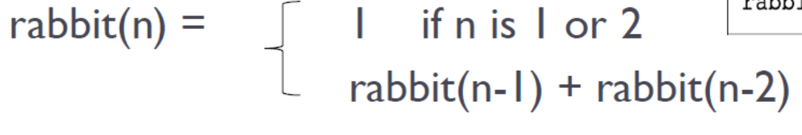
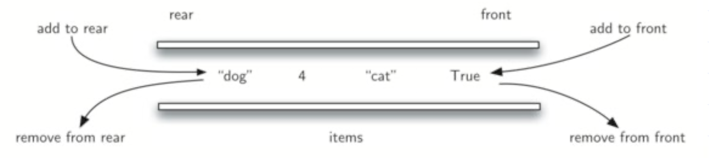

# Data Structure and Algorithm

## Practice
- [LeetCode](https://leetcode.com) 

## BigO
- worst case
- choose dominant terms 
- 
- 

## Algorithmn
### Recursive
- 4 Keys
  - How to define samller problem of same type
  - How can each call dinimish size
  - What case of problem can be base case
  - Can you reach base case
- Base Case
  - value for which perform no calls.
  - every recursive chain MUST reach base case.
- Recurvsive Call
  - each call solve an IDENTITICAL and SMALLER problem.
  - should be defined so that it towards base case, no problem smaller than base case is allowed.
- Vizualization: 
#### Binary Search
- 
- BigO logn : 

#### Type 
- Head Recursion: 
- Tail Recursion: 
- More : [geeksforgeeks types of recursions](https://www.geeksforgeeks.org/types-of-recursions/)

#### Fibonacci Sequence

```
def fibonacci(n):
    if n <= 0:
        return 0
    elif n == 1:
        return 1
    else:
        return fibonacci(n - 1) + fibonacci(n - 2)
```
- BigO : O(n) (make n recursive calls)


- BigO :
  - Time Complexity: O(n) (Cached) / O(n^2)
  - Space Complexity: O(n) (Cached) / O(n) (due to the recursion stack)
#### Power Function


- Intuition :
  -  b^100 = b^50 * b^50
  -  b^101 = b * b^50 * b^50
-  Definition :
   -  n = 0 -> b^n = 1  
   -  n > 0 && = even -> b^n/2 * b^n/2
   -  n > 0 && = odd -> b * b^n/2 * b^n/2
- Implementation :
  - recursive :
    ```
    def power(x, n):
        if n == 0:
            return 1  # Base case: x^0 = 1
        elif n < 0:
            return 1 / power(x, -n)  
        elif n % 2 == 0:
            half_power = power(x, n // 2)  
            return half_power * half_power  
            half_power = power(x, (n - 1) // 2)  
            return x * half_power * half_power  
    ```
  -  recursive simple :
        ```
        def power_recursive(x, n):
            if n == 0:
                return 1  # Base case: x^0 = 1
            elif n < 0:
                return 1 / power_recursive(x, -n) 
            else:
                return x * power_recursive(x, n - 1)
        ``` 
  - iterative  :
    ```
    def power_iterative(x, n):
        result = 1
        for _ in range(n):
            result *= x
        return result
    ```
    
- BigO :
  - Time Complexity: O(logn) / O(n) (re. simple) 
  - Space Complexity: O(logn) / O(n) (re. simple) / O(1) (iterative)

#### Hanoi Tower

```
def hanoi(n, source, target, auxiliary):
    if n == 1:
        print(f"Move disk 1 from {source} to {target}")
        return
    hanoi(n - 1, source, auxiliary, target)
    print(f"Move disk {n} from {source} to {target}")
    hanoi(n - 1, auxiliary, target, source)
```


- Step : 2^n - 1
- BigO : 
  - Time Complexity: O(2^n)
  - Space Complexity: O(n)


## Abstract Data Type
- collection of data
- set of operations on that data

### Linear 
- ordered
- can add or remove into particular position
#### Stack
- Last-in & First-out (LIFO) 
- Operation :
  - push(onTop)
  - pop(theFirst)
  - peek(theLast)
  - isEmpty()
  - size()
- Implementation :
    ```
    class Stack:
        def __init__(self):
            self.items = []

        def push(self, item):
            self.items.append(item)

        def pop(self):
            return self.items.pop() if self.items else None

        def peek(self):
            return self.items[-1] if self.items else None

        def is_empty(self):
            return len(self.items) == 0
    ```
- BigO :
  - push/pop :  O(1)
- 
- Application :
  - Checking for Balanced Braces
  - Bracket Matching 
  - Postfix Calcultion 


#### Queue
- ordered collection of items
- First-in, First-out (FIFO)
- Operations :
  - enqueue(toLast)
  - dequeue(theFirst)
  - peek()
  - isEmpty()
  - size()
- Implementation :
    ```
    class SimpleQueue:
        def __init__(self):
            self.queue = []

        def enqueue(self, item):
            self.queue.append(item)

        def dequeue(self):
            if not self.is_empty():
                return self.queue.pop(0)
            raise IndexError("Dequeue from empty queue")

        def is_empty(self):
            return len(self.queue) == 0

        def size(self):
            return len(self.queue)
    ``` 
- Hot Potato
 
    ```
    def hot_potato(players, num_passes):
        while len(players) > 1:
            for _ in range(num_passes):
                players.push(players.dequeue())  
            eliminated = players.dequeue()
        return players.peek()
    ```
- Circular Queue : 
  - 
  - 
  ```
  class CircularQueue:
    def __init__(self, size):
        self.size = size
        self.queue = [None] * size
        self.front = -1
        self.rear = -1

    def is_empty(self):
        return self.front == -1

    def is_full(self):
        return (self.rear + 1) % self.size == self.front

    def enqueue(self, item):
        if self.is_full():
            return
        if self.is_empty():
            self.front = 0
        self.rear = (self.rear + 1) % self.size
        self.queue[self.rear] = item

    def dequeue(self):
        if self.is_empty():
            print("Queue is empty!")
            return None
        item = self.queue[self.front]
        if self.front == self.rear:  # Queue has only one element
            self.front = -1
            self.rear = -1
        else:
            self.front = (self.front + 1) % self.size
        return item

    def peek(self):
        if self.is_empty():
            return None
        return self.queue[self.front]
  ```
- Round Robin Scheduler
   
    ```
    class Process:
        def __init__(self, name, burst_time):
            self.name = name
            self.burst_time = burst_time
            self.remaining_time = burst_time


    def round_robin(processes, time_quantum):
        # time quantum refers to the fixed amount of time that each process is allowed to run 
        time = 0
        # tracking execution time
        
        queue = CircularQueue(len(processes))
        for process in processes:
            queue.enqueue(process)

        while not queue.is_empty():
            current_process = queue.dequeue()
            if current_process.remaining_time > time_quantum:
                time += time_quantum
                # simulate execution for time_quantum
                current_process.remaining_time -= time_quantum 
                queue.enqueue(current_process)
            else:
                time += current_process.remaining_time
                # simulate finishing execution
                current_process.remaining_time = 0
    ```

#### Stack vs Queue

| Stack | Queue |
|----------|----------|
| LIFO    | FIFO   |
| Good for Py List    | Bad for Py List   |
| push(), pop(), peek() : O(1)    | enqueue()(Py List):O(n), enqueue()(Circular) dequeue(), peek() : O(1)   |


#### Deque
- ordered collection 
- added or removed on both front or back
- does not require LIFO or FIFO orderings
- 
- Operations :
  - add_front()
  - add_rear()
  - remove_front()
  - remove_rear()
  - isEmpty()
  - size()
- BigO :
  - front : O(1)
  - rear : O(n)
- Application :
  - Palindrome Checker :
    - radar
    - deed
    ```
    def is_palindrome(s):
        cleaned_str = ''.join(s.split()).lower()
        char_deque = deque(cleaned_str)

        while len(char_deque) > 1:
            if char_deque.remove_front() != char_deque.remove_rear():
                return False
        return True
    ```