# Design Pattern

## Singleton
- Ensuring that one and only one object of the class gets created 
- Providing an access point for an object that is global to the program 
- Controlling concurrent access to resources that are shared
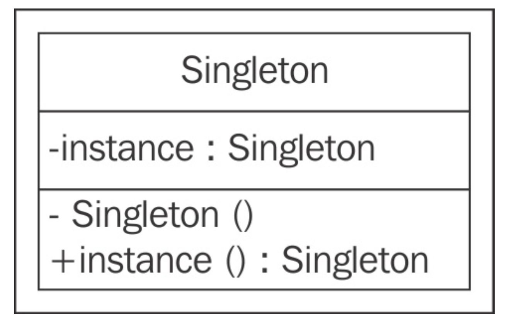

## Fatory Pattern
### Simple Factory Pattern
- This allows interfaces to create objects without exposing the object creation logic.
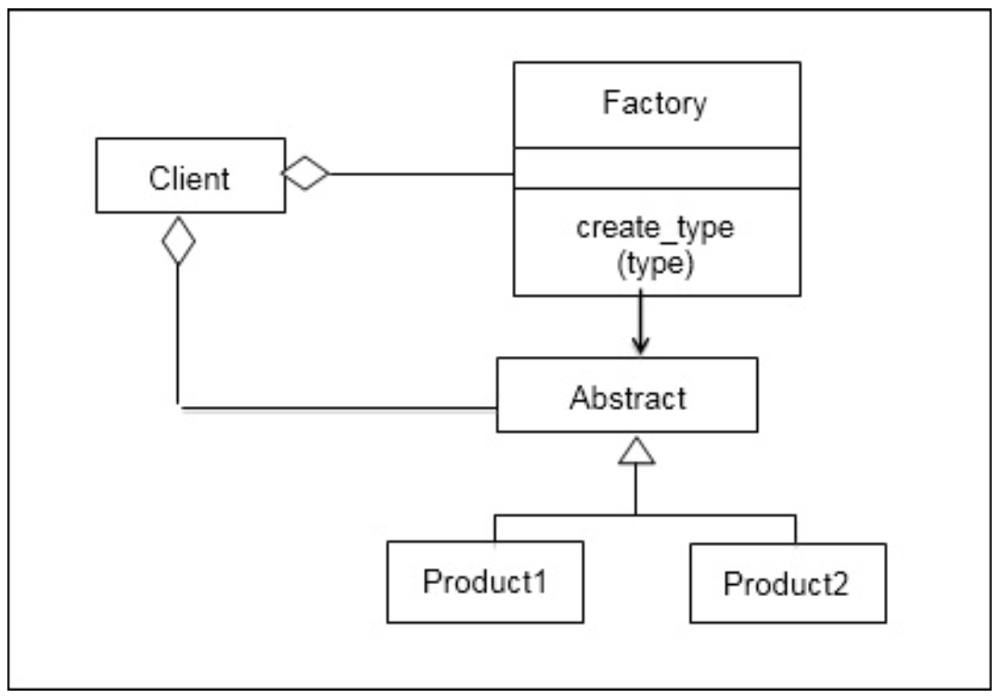
### Factory method pattern: 
- This allows interfaces to create objects, but defers the decision to the subclasses to determine the class for object creation. 
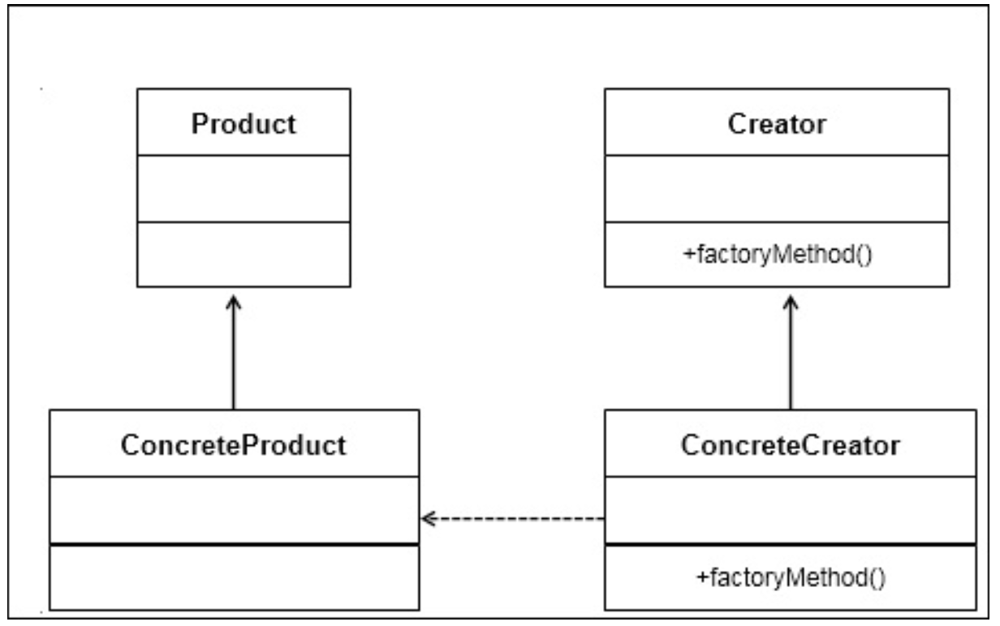
### Abstract Factory pattern: 
- An Abstract Factory is an interface to create related objects without specifying/exposing their classes. The pattern provides objects of another factory, which internally creates other objects.
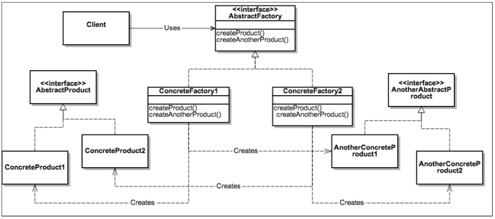
### vs Inheritance  
- Factory Method uses polymorphism, via inheritance, to defer object creation to subclasses.

## Structural Pattern

### Façade Desigin Pattern
- It provides a unified interface to a set of interfaces in a subsystem and defines a high- level interface that helps the client use the subsystem in an easy way.
- Façade discusses representing a complex subsystem with a single interface object. It doesn’t encapsulate the subsystem but actually combines the underlying subsystems. 
- It promotes the decoupling of the implementation with multiple clients.
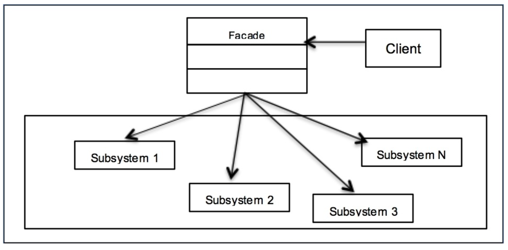
  - Façade: 
    > The main responsibility of a façade is to wrap up a complex group of subsystems so that it can provide a pleasing look to the outside world.
  - System: 
    > This represents a set of varied subsystems that make the whole system compound and difficult to view or work with.
  - Client: 
    > The client interacts with the Façade so that it can easily communicate with the subsystem and get the work completed. It doesn’t have to bother about the complex nature of the system.

## Proxy Pattern

- It provides a surrogate for another object so that you can control access to the original object
- It is used as a layer or interface to support distributed access
- It adds delegation and protects the real component from undesired impact
- 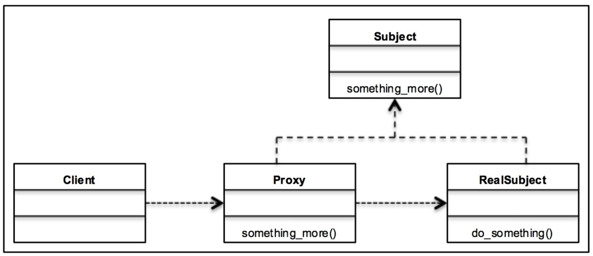
  - Proxy: 
    > This maintains a reference that lets the Proxy access the real object. It provides an interface identical to the  Subject so that Proxy can substitute the real subject. Proxies are also responsible for creating and deleting the RealSubject. 
  - Subject: 
    > It provides a representation for both, the RealSubject and Proxy. As Proxy and RealSubject implement Subject, Proxy can be used wherever RealSubject is expected.
  - RealSubject: 
    > It defines the real object that the Proxy represents.
### Virtual Proxy
> Here, you’ll learn in detail about the virtual proxy. It is a placeholder for objects that are very heavy to instantiate. For example, you want to load a large image on your website. Now this request will take a long time to load. Typically, developers will create a placeholder icon on the web page suggesting that there’s an image. However, the image will only be loaded when the user actually clicks on the icon thus saving the cost of loading a heavy image in memory. Thus, in virtual proxies, the real object is created when the client first requests or accesses the object.
### Remote Proxy
> A remote proxy can be defined in the following terms. It provides a local representation of a real object that resides on a remote server or different address space. For example, you want to build a monitoring system for your application that has multiple web servers, DB servers, celery task servers, caching servers, among others. If we want to monitor the CPU and disk utilization of these servers, we need to have an object that is available in the context of where the monitoring application runs but can perform remote commands to get the actual parameter values. In such cases, having a remote proxy object that is a local representation of the remote object would help.
### Protective Proxy
> You’ll understand more about the protective proxy with the following points. This proxy controls access to the sensitive matter object of RealSubject. For example, in today’s world of distributed systems, web applications have multiple services that work together to provide functionality. Now, in such systems, an authentication service acts as a protective proxy server that is responsible for authentication and authorization. In this case, Proxy internally helps in protecting the core functionality of the website for unrecognized or unauthorized agents. Thus, the surrogate object checks that the caller has access permissions required to forward the request.
### Smart Proxy
> Smart proxies interpose additional actions when an object is accessed. For example, consider that there’s a core component in the system that stores states in a centralized location. Typically, such a component gets called by multiple different services to complete their tasks and can result in issues with shared resources. Instead of services directly invoking the core component, a smart proxy is built-in and checks whether the real object is locked before it is accessed in order to ensure that no other object can change it.
- Proxy vs Facaed : 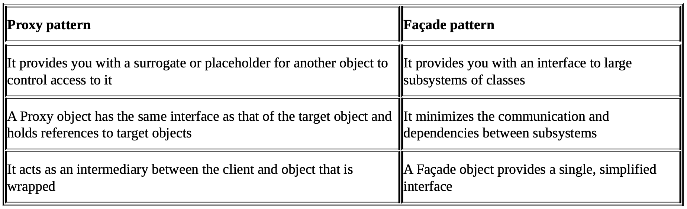
- Proxy pattern vs Decorator pattern: 
  > A Decorator adds behavior to the object that it decorates at runtime, while a Proxy controls access to an object. The relationship between Proxy and RealSubject is at compile time and not dynamic.

## Behavioral Pattern
### Observer Pattern
- It defines a one-to-many dependency between objects so that any change in one object will be notified to the other dependent objects automatically
- It encapsulates the core component of the Subject
- 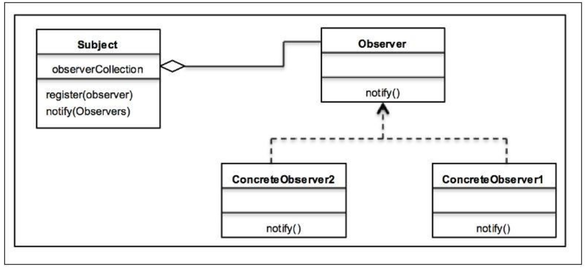
- model
  - pull 
    - The Subject broadcasts to all the registered Observers when there is any change 
    - The Observer is responsible for getting the changes or pulling data from the subscriber when there is an amendment
    - The pull model is ineffective as it involves two steps—the first step where the Subject notifies the Observer and the second step where the Observer pulls the required data from the Subject
  - push
    - Unlike the pull model, the changes are pushed by the Subject to the Observer.
    - In this model, the Subject can send detailed information to the Observer (even though it may not be needed). This can result in sluggish response times when a large amount of data is sent by the Subject but is never actually used by the Observer. 
    - Only the required data is sent from the Subject so that the performance is better.
- Loose coupling and the Observer pattern :
  > Loose coupling is an important design principle that should be used in software applications. The main purpose of loose coupling is to strive for loosely-coupled designs between objects that interact with each other. Coupling refers to the degree of knowledge that one object has about the other object that it interacts with.
  
  
### Command Pattern 
- Command, Receiver, Invoker, and Client:
  - A Command object knows about the Receiver objects and invokes a method of the Receiver object.
  - Values for parameters of the receiver method are stored in the Command object 
  - The invoker knows how to execute a command
  - The client creates a Command object and sets its receiver 
- The main intentions of the Command pattern are as follows:
  - Encapsulating a request as an object
  - Allowing the parameterization of clients with different requests
  - Allowing to save the requests in a queue (we will talk about this later in the chapter) 
  - Providing an object-oriented callback
- 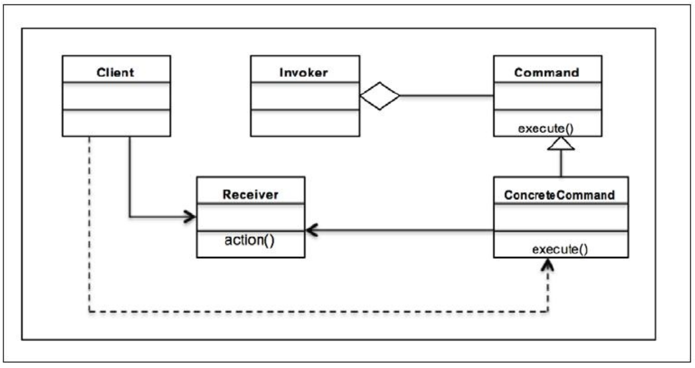
  - Command: This declares an interface to execute an operation
  - ConcreteCommand: This defines a binding between the Receiver object and action Client: This creates a ConcreteCommand object and sets its receiver
  - Invoker: This asks ConcreteCommand to carry out the request
  - Receiver: This knows how to perform the operations associated with carrying out the request
- Redo or rollback operations:
  - While implementing the rollback or redo operations, developers can do two different things.
  - These are to create a snapshot in the filesystem or memory, and when asked for a rollback, revert to this snapshot.
  - With the Command pattern, you can store the sequence of commands, and when asked for a redo, rerun the same set of actions.
- Asynchronous task execution:
  - In distributed systems, we often need the facility to perform the asynchronous execution of tasks so that the core service is never blocked in case of more requests. 
  - In the Command pattern, the invoker object can maintain a queue of requests and send these tasks to the Receiver object so that they can be acted on independent of the main application thread.

### Template Method Pattern

- Defining a skeleton of an algorithm with primitive operations
- Redefining certain operations of the subclass without changing the algorithm’s structure
- Achieving code reuse and avoiding duplicate efforts
- Leveraging common interfaces or implementations 
- 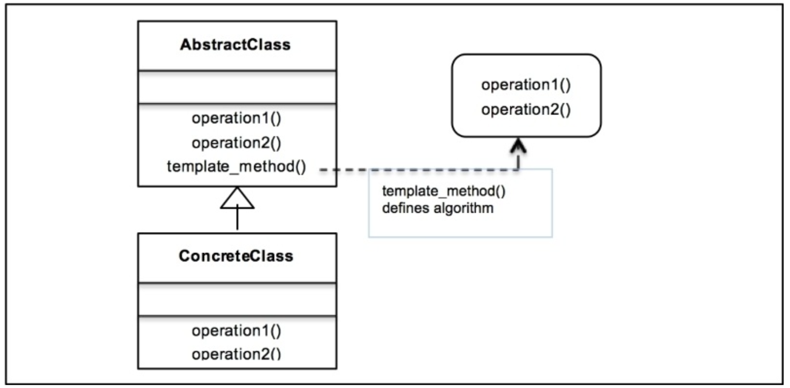
  - AbstractClass: This declares an interface to define the steps of the algorithm 
  - ConcreteClass: This defines subclass-specific step definitions 
  - template_method(): This defines the algorithm by calling the step methods
- Hooks
  > A hook is a method that is declared in the abstract class. It is generally given a default implementation. The idea behind hooks is to give a subclass the ability to hook into the algorithm whenever needed. It’s not imperative for the subclass to use hooks and it can easily ignore this.
- Hollywood principle
  > In the object-oriented world, we allow low-level components to hook themselves into the system with the Hollywood principle. However, the high-level components determine how the low-level systems are needed and when they are needed. In other words, high-level components treat low-level components as Don’t call us, we’ll call you.
  This relates to the Template Method pattern in the sense that it’s the high-level abstract class that arranges the steps to define the algorithm. Based on how the algorithm is, low- level classes are called on to define the concrete implementation for the steps. 
- FAQ
  - Q1. Should a low-level component be disallowed from calling a method in a higher-level component?
    > A: No, a low-level component would definitely call the higher-level component through inheritance. However, what the programmer needs to make sure is that there is no circular dependency where the low-level and high-level components are dependent on each other.
  - Q2. Isn’t the strategy pattern similar to the Template pattern?
    > A: The strategy pattern and Template pattern both encapsulate algorithms. Template depends on inheritance while strategy uses composition. The Template Method pattern is a compile-time algorithm selection by sub-classing while the strategy pattern is a runtime selection.

### State Design Pattern

> the State pattern allows an object to change its behavior when its internal state changes. It will appear as though the object itself has changed its class. The State design pattern is used to develop Finite State Machines and helps to accommodate State Transaction Actions.

- 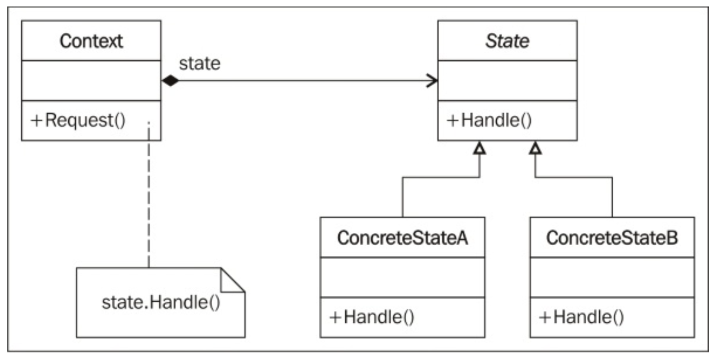
  - State: This is an interface that defines the Handle() abstract method. The Handle() method needs to be implemented by ConcreteState.
  - ConcreteState: In this UML diagram, we have defined two ConcreteClasses: ConcreteStateA, and ConcreteStateB. These implement the Handle() method and define the actual action to be taken based on the State change.
  - Context: This is a class that accepts the client’s request. It also maintains a reference to the object’s current state. Based on the request, the concrete behavior gets called.

    
## Compound Patterns
> As GoF defines, “a compound pattern combines two or more patterns into a solution that solves a recurring or general problem.” A Compound pattern is not a set of patterns working together; it is a general solution to a problem.

### Model-View-Controller 
- 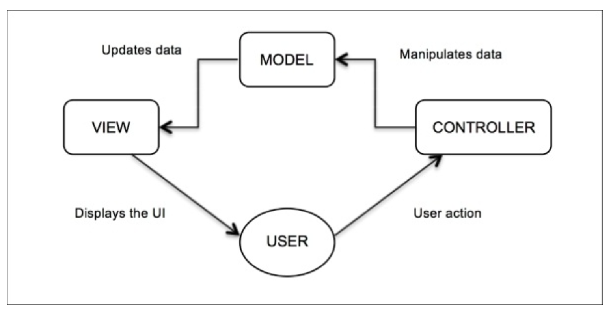
  - Model: This declares a class to store and manipulate data
  - View: This declares a class to build user interfaces and data displays
  - Controller: This declares a class that connects the model and view
  - User: This declares a class that requests for certain results based on certain actions
- 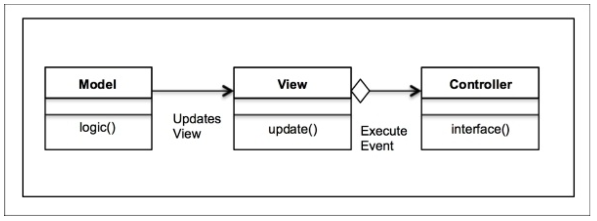
- MTV
  > Our good old web application frameworks are based on the philosophies of MVC. Take the example of Django or Rails (Ruby): they structure their projects in the Model-View- Controller format except that it is represented as MTV (Model, Template, View) where the model is the database, templates are the views, and controllers are the views/routes.
- FQA
  - Q1. Isn’t MVC a pattern? Why is it called a Compound pattern?
    > A: Compound patterns are essentially groups of patterns put together to solve large design problems in software application development. The MVC pattern is the most popular and widely used Compound pattern. As it is so widely used and reliable, it is treated as a pattern itself.
  - Q2. Is MVC used only in websites?
    > A: No, a website is the best example to describe MVC. However, MVC can be used in multiple areas such as GUI applications or any other place where you need loose coupling and splitting of components in an independent way. Typical examples of MVC include blogs, movie database applications, and video streaming web apps. While MVC is useful in many places, it’s overkill if you use it for the landing pages, marketing content, or quick single-page applications.
  - Q3. Can multiple views work with multiple models?
    > A: Yes, often you’d end up in a situation where the data needs to be collated from multiple models and presented in one view. One-to-one mapping is rare in today’s web app world.

## AntiPatterns

> Software design principles represent a set of rules or guidelines that help software developers make design-level decisions. According to Robert Martin, there are four aspects of a bad design:
- Immobile: An application is developed in such a way that it becomes very hard to reuse
- Rigid: An application is developed in such a manner that any small change may in turn result in moving of too many parts of the software
- Fragile: Any change in the current application results in breaking the existing system fairly easily
- Viscose: Changes are done by the developer in the code or environment itself to avoid difficult architectural level changes
- AntiPatterns can be classified under two main categories:
  - SoftwaredevelopmentAntiPatterns   
  - SoftwarearchitectureAntiPatterns
- Refactoring 
  > taken with a negative connotation by many, but in reality, refactoring is one of the critical parts of the software development journey, which provides developers an opportunity to relook the data structures and think about scalability and ever-evolving customer’s needs.
  
- Examples :
  - Spaghetti code
    > This is the most common and most heard of AntiPattern in software development. Do you know how spaghetti looks? So complicated, isn’t it? Software control flows also get tangled if structures are developed in an ad hoc manner. Spaghetti code is difficult to maintain and optimize.
  - Golden Hammer
    > In the software industry, you would have seen many examples where a given solution (technology, design, or module) is used in many places because the solution would have yielded benefits in multiple projects. As we have seen with examples throughout this book, a solution is best suited in a given context and applied to certain types of problems. However, teams or software developers tend to go with one proven solution irrespective of whether it suits the need. This is the reason that it’s called Golden Hammer, a hammer for all the nails possible (a solution to all problems).
  - Lava Flow
    > This AntiPattern is related to Dead Code, or an unusable piece of code, lying in the software application for the fear of breaking something else if it is modified. As more time passes, this piece of code continues to remain in the software and solidifies its position, like lava turning into a hard rock. It may happen in cases where you start developing software to support a certain use case but the use case itself changes with time.
  - Copy-and-paste or cut-and-paste programming
    > As you know, this is one of the most common AntiPatterns. Experienced developers put their code snippets online (GitHub or Stack Overflow) that are solutions to some commonly occurring issues. Developers often copy these snippets as is and use in their application to move further in the application development. In this case, there is no validation that this is the most optimized code or even that the code actually fits the context. This leads to inflexible software application that is hard to maintain.
  - Reinventing the wheel
    > We often hear technology leaders talking about NOT reinventing the wheel. What does it essentially mean? For some, this may mean code or library reuse. Actually, it points to architecture reuse. For example, you have solved a problem and come up with an architecture-level solution. If you encounter a similar problem in any other application, the thought process (architecture or design) that was developed earlier should be reused. There is no point in revisiting the same problem and devising a solution, which is essentially reinventing the wheel. 
  - Vendor lock-in
    > As the name of the AntiPattern suggests, product companies tend to be dependent on some of the technologies provided by their vendors. These technologies are so glued to their system that it is very difficult to move away.
  - Design by committee
    > Sometimes, based on the process in an organization, a group of people sit together and design a particular system. The resulting software architecture is often complex or substandard because it involves too many thought processes, and technologists who may not have the right skillset or experience in designing the products have put forward the ideas.