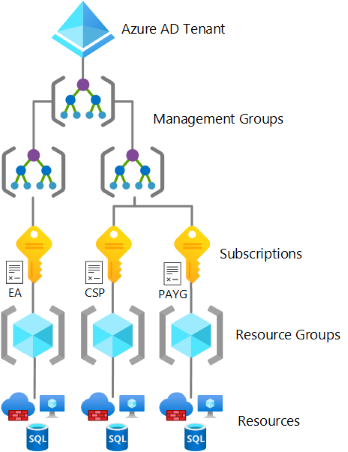
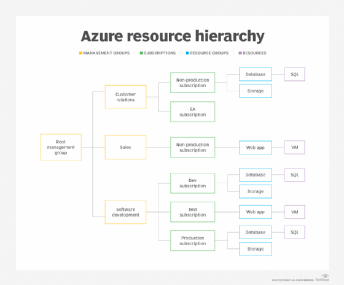
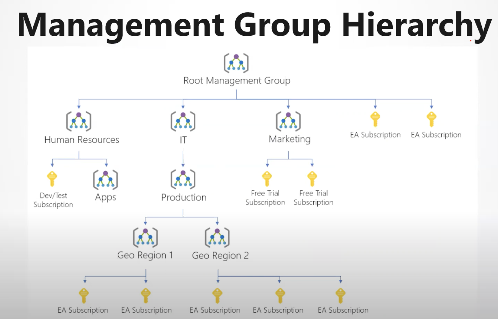
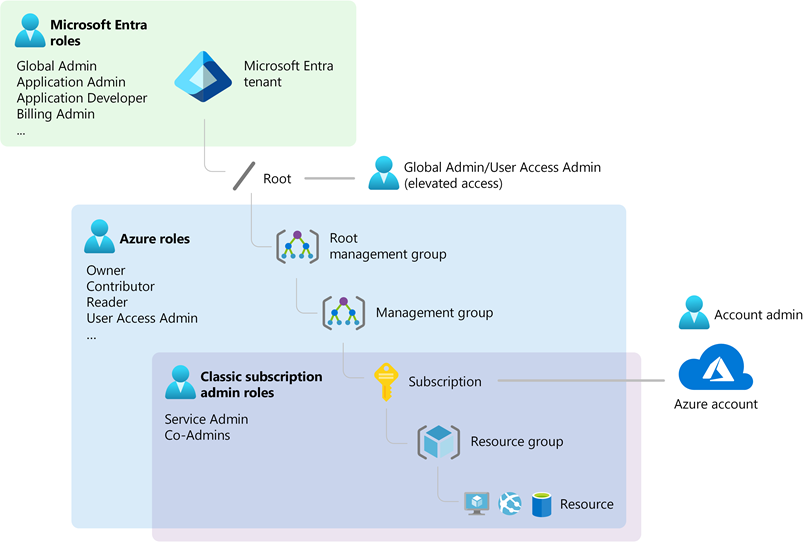
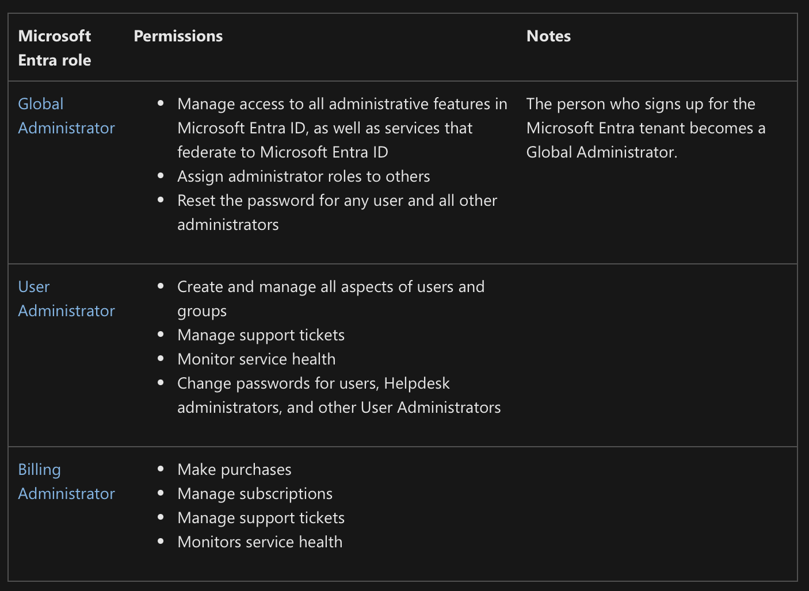
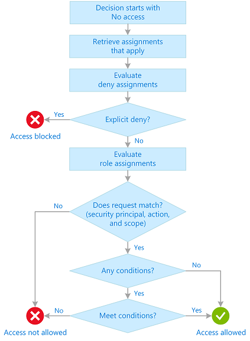

# Azure

## Hieracchy
- An Azure Tenant is a separation boundary between one customer and another.
- A Directory is an identity service that exists in a tenant.
You can have only one directory in a tenant at a time.

## User

## Access 

- You can also add conditions to specific actions. For example, you can grant John read access to blobs in your subscription only if the blobs are tagged as Project=Blue.

