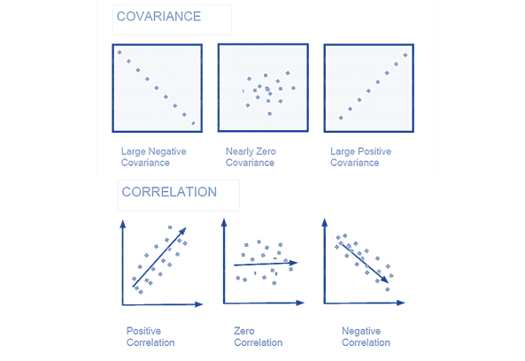
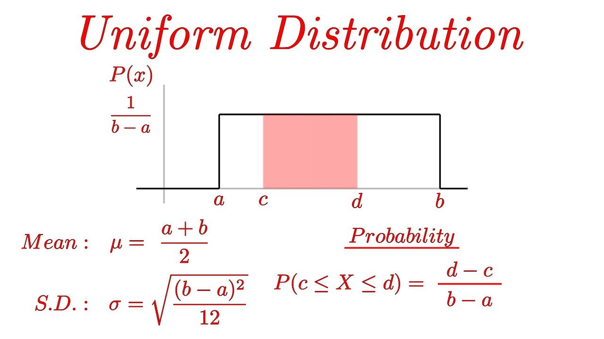
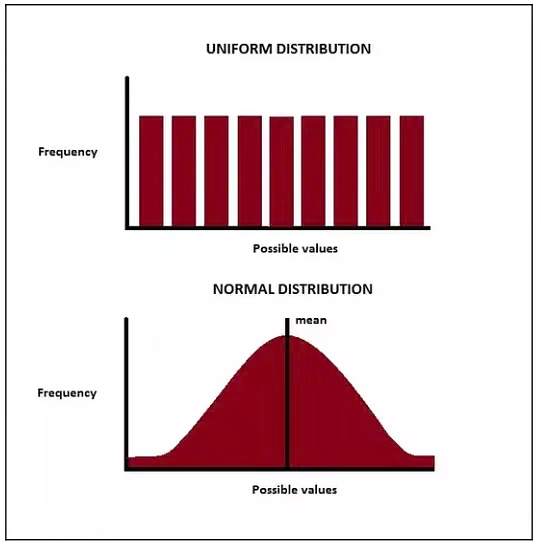
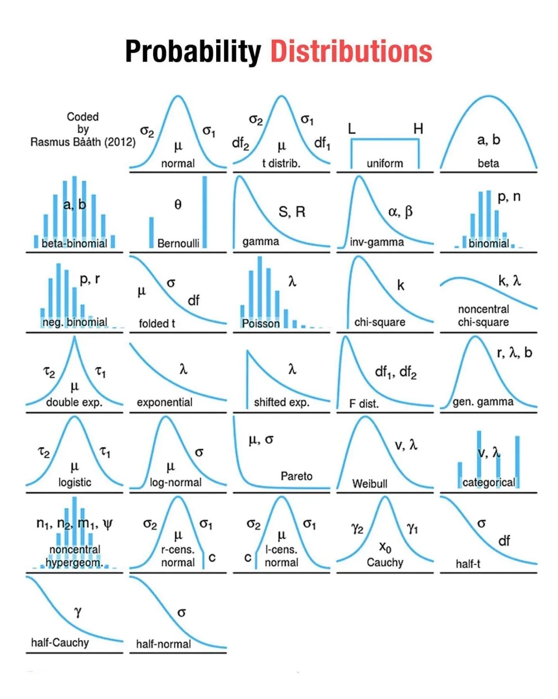
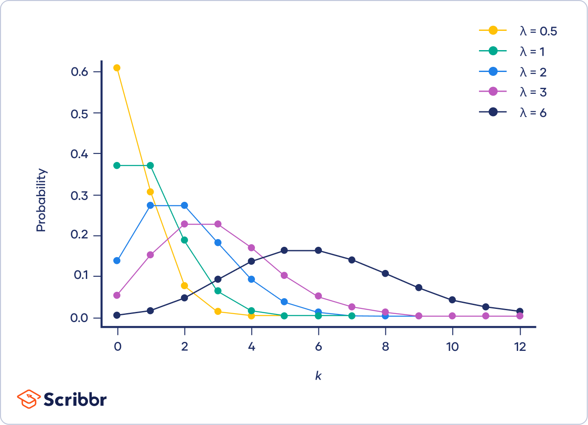

# PA

## Statistics

### Tips
- Covariance vs Correlation : 

- Uniform Distribution : 
- Uniform Distribution vs Normal Distribution : 
- II is 1/0 indicator function
- Φ is the cdf of the Gaussian

### Probability Distribution

- Probability Distributions : 
- A probability distribution function (PDF), There are two types of PDFs:
  - probability mass function (PMF)
  - probability density function (PDF)
  - cumulative distribution function (CDF)
  - PMF vs PDF :
    - PMF:
  The PMF is used to describe the probability distribution of a discrete random variable.
  The PMF gives the probability that a discrete random variable takes on a specific value.
  The y-axis of the PMF represents the probability of the corresponding x-value.
    - PDF:
The PDF is used to describe the probability distribution of a continuous random variable.
The PDF gives the probability density of a continuous random variable at a specific point.
The y-axis of the PDF represents the probability density at the corresponding x-value.

### Poisson Distribution
- A probability distribution that is used to show how many times an event is likely to occur over a
specified period.
- $$P(X = k) = \frac{e^{-\lambda}\lambda^k}{k!}$$
- 