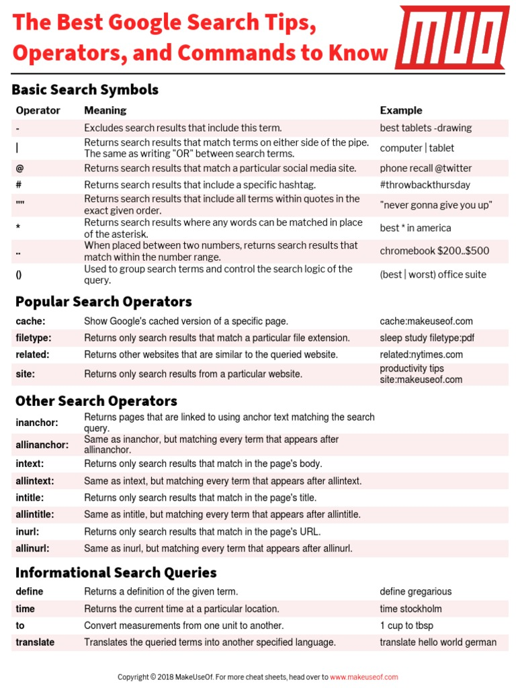

# Search

## Basic
- Focus URL Bar :  <kbd>Ctrl</kbd> +  <kbd>L</kbd>
- Focus Search Bar :  <kbd>/</kbd>

- Find : <kbd>Ctrl</kbd> + <kbd>F</kbd> 
  - Go to Found : <kbd>Shift</kbd> + <kbd>Enter</kbd> 

## Youtube

- Fullscreen : <kbd>F</kbd> 
- Cinema : <kbd>T</kbd> 
- Mute : <kbd>M</kbd> 
- Play / Pause : <kbd>Space</kbd> 
- Fullscreen : <kbd>F</kbd> 
- Captions : <kbd>C</kbd> 

## References 

