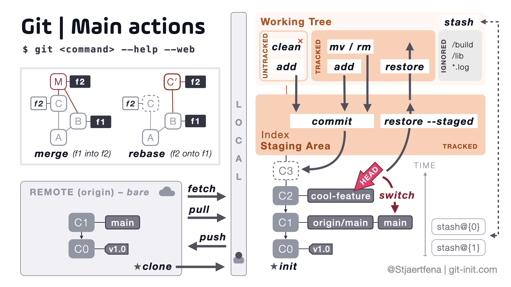
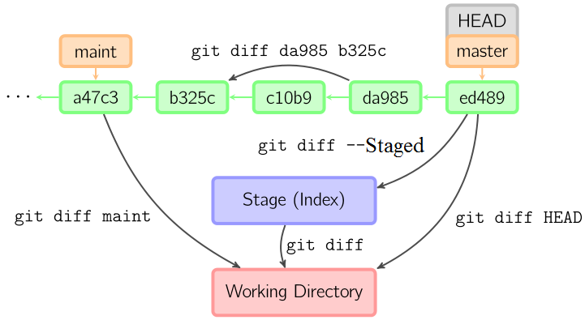
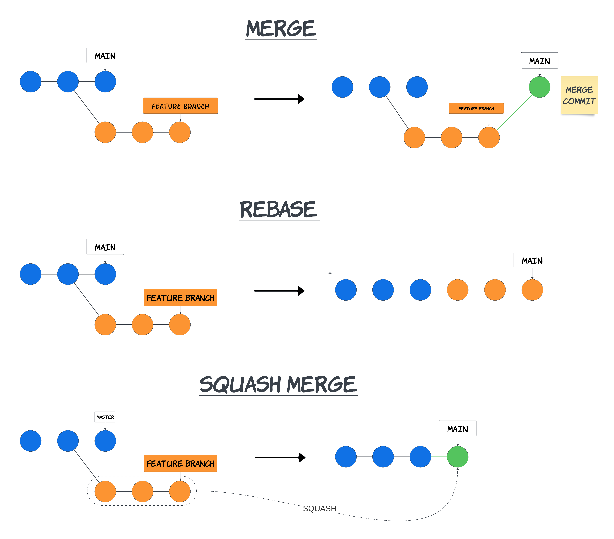
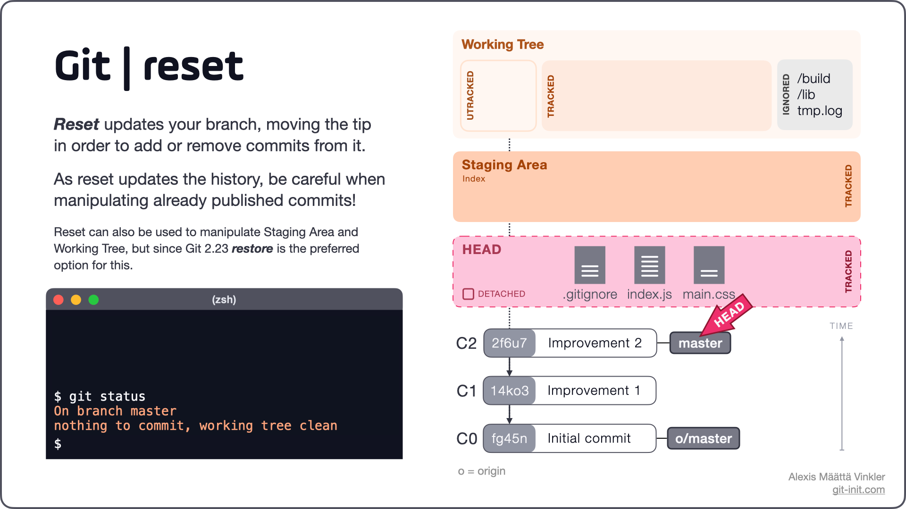
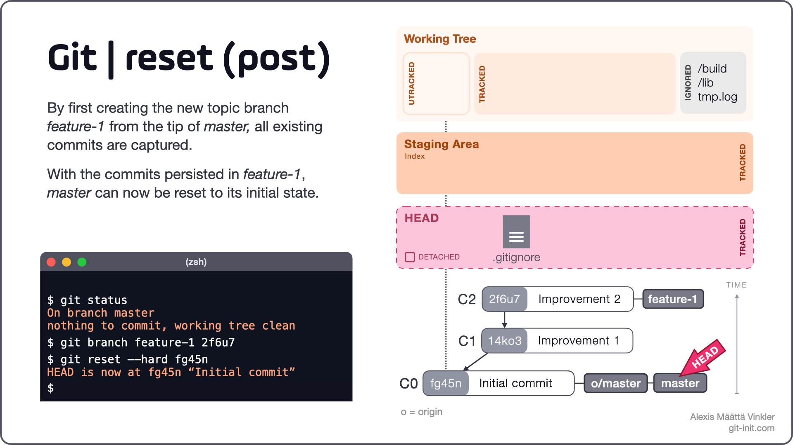
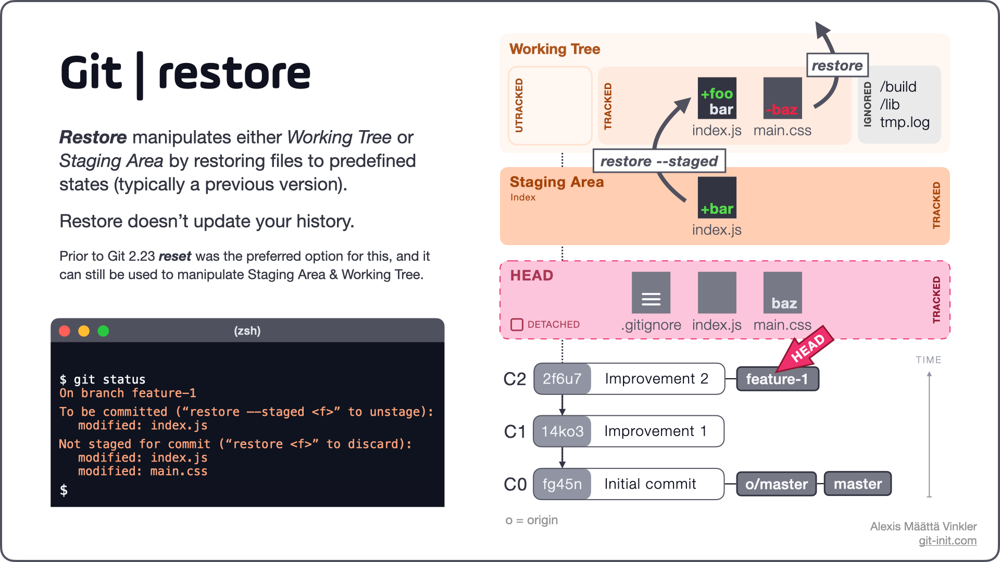
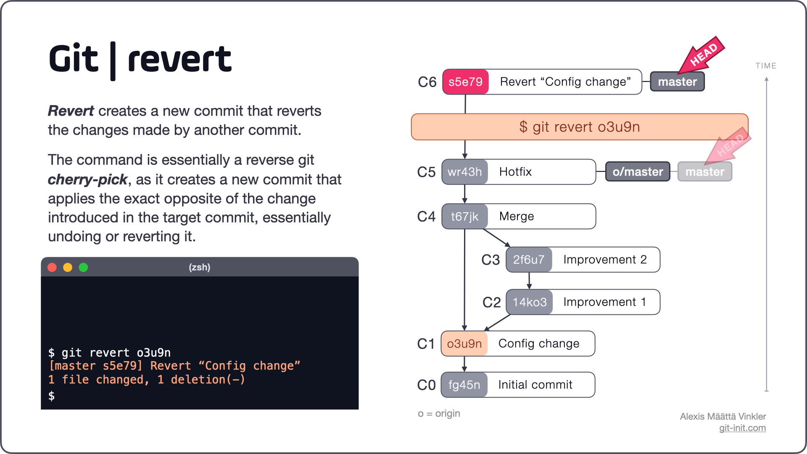
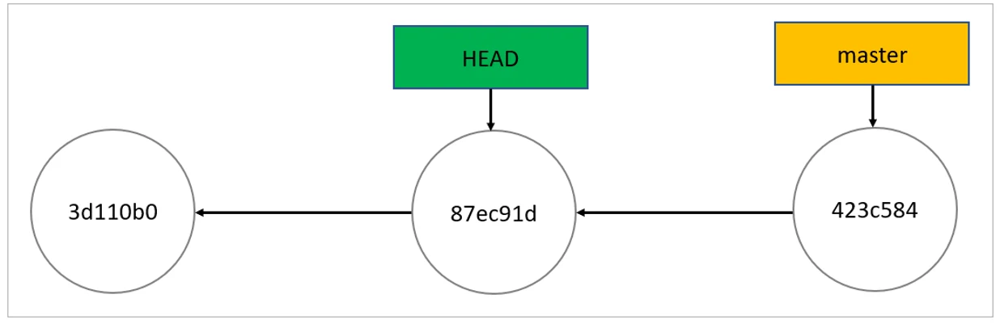
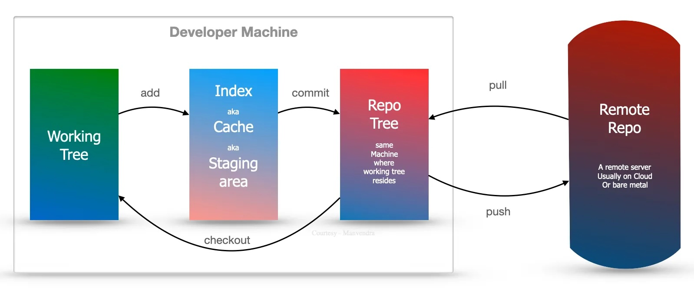

# Visual Studio Code

## Tips
- Objects : Git stores files as objects in a content-addressable manner using SHA-1 hashes. 
- Git will reference the existing object rather than create a new copy.
- Snapshots : Each commit in Git is a snapshot of the project's entire state.
- Incremental Storage : Git efficiently manages storage by only saving changes (deltas).
- Branches share same staging files and working directory, but not commits
- `--stage` == `--cached`
## Learn
[Learn Git Branching](https://learngitbranching.js.org/)

## Blog
[Pragmatic Git](https://blog.git-init.com/)

## Overview


## Install
- Windows : 
    - Git : `winget install --id Git.Git -e --source winget`
    - Github CLI : `winget install --id=GitHub.cli  -e`
- MacOS : 
    - Git : `brew install git`
    - Github CLI : `brew install gh`     
- Linux:
  - Git: `sudo apt install git` (Debian-based)
  - GitHub CLI: `sudo apt install gh` (Debian-based)

## Setup
- Login :
    ```
    gh auth login
    gh auth setup-git
    ```
- Profile :
    ```
    git config --global user.email "asuralhp@gmail.com"
    git config --global user.name "asuralhp"
    ```
- Clone : `git clone https://github.com/libgit2/libgit2`
  - Recursive : `git clone --recursive --shallow-submodules https://github.com/libgit2/libgit2`
- Initialization (Optional if Repo exits): 
    ```
    git init
    git add -A
    git commit -m "Init"
    git branch -M main
    ```


## Read

### Read - Commit
- Check Staged/Commited Status : `git status` + `-s` for short 
- Logs of Commits : `git log`
  - One Line : `git log --oneline`
  - First Commit : `git log -1`
  - Occurence : `git log -S function_name`
  - Directory / File : `git log -- path/to/file`
  - Date : `git log --since="2008-10-01" --before="2008-11-01"`
  - Log ADOG : `git log --all --decorate --oneline --graph `
  - Commits Not Reachable From `<branch>`..`<branch>` : 
    - `git log master..experiment`
    - `git log origin/main..HEAD `
  - File : `-L :<string>:<file>`
- Reflog : `git reflog`
- Shortlog : `git shortlog`
  - No Merge | Branch | Not Up to Tag : `git shortlog --no-merges master --not v1.0.1`
- Log of Single Commit : `git show <commit-hash>`
  - Log of First Commit : `git show HEAD`
  - Date Commit : `git show HEAD@{yesterday}`

### Read - Branch
- Remote Infomation : `git remote show <remote>`
- All Branch : `git branch -a`
- Tracking Branch : `git branch -vv`
  - Up to Date : `git fetch --all; git branch -vv`
- All Remote : `git remote -v`

### Read - Diff
- Check Directory <-> Staged : `git diff`
  - Name Only: `git diff --name-only`
  - Check Staged <-> Commited : `git diff --staged`
  - Check Local HEAD <-> Remote HEAD : 
    ```
    git fetch origin
    git diff HEAD origin/<branch>
    ```
  - Others : 
- Dry Run : `git add --dry-run .`

### Read - Fork
- Show Github Pull Request Ref : `git ls-remote <remote>`
## Edit

### Search
- Grep for Repository : `git grep`
  - Line Number : `-n`
  - Count Number : `-c`
  - Enclosing : `-p`

### Edit - Branch

- Merge Branch : `git merge <branch>`
  - Squash Merge : `git merge --squash <branch>`
  - Fast-Forward : `git merge --ff-only <branch>`
- Rebase Branch : `git rebase <branch>`
  - Squash Commit : 
    - `git log -<num>`
    - `git rebase -i Head~<num>`
    - `p prefix for keep commit`
    - `s prefix for squash commit`
    - `git log --oneline`
- Cherry Pick : `git cherry-pick <commit>`
- Create Branch : `git branch <branch>`
- Switch and Create Branch : `git checkout -b <branch>`
  - Branch From : `git checkout -b <branch> <remote>/<branch>`
  - Alternate : `git switch -c <branch`
- Switch Branch : `git checkout <branch>`
  - Alternate : `git switch <branch>`
- Previous Branch : `git switch -`
- Delete Branch : `git branch -d <branch>`

#### Info
- fast-foward(3 ways) vs non-fast-forward : add a commit to merge or change pointer to the latest commit

### Edit - Commit
- Set to Commit : `reset --hard <commit>`
  - Set to Previous Commit from Head: `reset --hard HEAD~1`
  - Keep Stage : `--soft`
- Rewrite Commit :   `git commit --amend [-m "New Name"]`
  - Use Same Message : `--no-edit`
  - **Warning** : Do not use `--amend` on remote commit


### Edit - Stage
- Add All Files : `git add .`
- Interative Shell : `git add -i` 
- Move File : `git mv file_from file_to`
  - equivalent : 
    ```
    mv README.md README
    git rm README.md
    git add README
    ```

### Edit - Working Directory
- Save Files Change : `git stash`
  - Keep Staged Change : `--keep-index`
  - Include Untracked Files : `--include-untracked -u`
  - Include Ignored Files : `--all -a`
    - Trick to clean but also save ~= `git clean`
  - Patch: `--patch -p`
- Paste Latest Stashed Change : `git stash apply`
  - Create Branch and apply where commit stashed: `git stash branch <branch>`
- List Stash : `git stash list`
- Drop Stash : `git stash drop stash@{0}`
- Clean Files: `git clean`
  - include Ignored Files : `-d`
  - include ignored Files : `-x`
  - Include Explicit-Delete Flag Files : `-f`
  - Interactive: `-i`
  - Dry Run : `--dry-run`


### Edit - Remote
- Add Remote : `git remote add <remote> <url> `
- Rename Remote : `git remote rename <remote> <remote_new>`
- Remove Remote : `git remote remove remote`
- Push Repository : `git push`
  - Push Specified Repository : `git push <remote> <branch>`
  - Init Relationship : `git push --set-upstream`
- Pull Repository : `git pull`
  - `git pull` = `git fetch` + `git merge`
  - Git Pull All Branches:
    ```bash
    git fetch --all

    # Loop through each branch
    for branch in $(git branch | sed 's/\\*//'); do
        git checkout $branch
        git pull
    done
    ```


### Edit - Fork
- Manual Pull Request : `curl https://github.com/<username>/<repo>/pull/1.patch | git am`

- Cross Pull Push :
  ```
  git remote add progit https://github.com/progit/progit2.git #set remote
  git fetch progit #update remote
  git branch --set-upstream-to=progit/master master #set pull(or push) to remote
  git config --local remote.pushDefault orig #set push to forked remote
  ```
## Tag
- List Tag : `git tag`
  - With Pattern : `git tag -l "v1.8.5*"`
- Show Tag : `git show <tag>` 
- Type of Tag :
  - lightweight
    - Add to Commit : `git tag <tag>`
  - annotated
    - Add to Commit : `git tag -a <tag> -m "<message>"`
  - Add to Specified Commit : `git tag -a <tag> <commit>`
- Delete Tag : `git tag -d <tag>`

### Edit - Tag
- Add Tag : `git `

## Reverse
- Uncommit Last : `git reset --soft HEAD^`
- Unstage File
  - If you want to keep your changes in your working directory but unstage them: `git reset <commit_hash>`
  - `--soft` : If you want to keep your changes staged (in the index) but move the HEAD to a previous commit
  - `--hard` : If you want to keep your changes in your working directory but unstage them
  - 
  - 
- Unstage All: `git restore --staged`
  - 
- Commit to Reset: `git revert`
  - 
- Unstage and Undo Working Directory : `git checkout -- <file>`

### Git Restore
> Undoing things with git restore
Git version 2.23.0 introduced a new command: git restore. It’s basically an alternative to git reset which we just covered. From Git version 2.23.0 onwards, Git will use git restore instead of git reset for many undo operations.

## Gitignore
- Example :
```
# ignore all .a files
*.a

# but do track lib.a, even though you're ignoring .a files above

!lib.a
# only ignore the TODO file in the current directory, not subdir/TODO

/TODO
# ignore all files in any directory named build
build/

# ignore doc/notes.txt, but not doc/server/arch.txt
doc/*.txt

# ignore all .pdf files in the doc/ directory and any of its subdirectories
doc/**/*.pdf
```
- Template : [Github/gitignore](https://github.com/github/gitignore)
- Nested .gitignore : only apply to subdirectories

## Configuration
- Location : 
  - Machine : etc/gitconfig
  - Global : ~/.gitconfig
  - Local :.git/config
- Set : `git config --list`
  - Show Origin : `git config --list --show-origin`

## Alias
- Exmaple : 
  ```
  git config --global alias.co checkout
  git config --global alias.br branch
  git config --global alias.ci commit
  git config --global alias.st status

  ```

## TroubleShoot
### Detached head 

> it means you are no longer on a branch, you have checked out a single commit in the history (in this case the commit previous to HEAD, i.e. HEAD^).

#### If you want to keep your changes associated with the detached HEAD
1. Run `git branch tmp` - this will save your changes in a new branch called tmp.
2. Run `git checkout master`
3. If you would like to incorporate the changes you made into `master`, run `git merge tmp` from the `master` branch. You should be on the `master` branch after running `git checkout master`.

#### If you want to delete your changes associated with the detached HEAD
1. You only need to checkout the branch you were on, e.g. `git checkout master`

#### Want to restore it in working directory to the state it is in the index, don't delete the file, just do
1. `git checkout -- path/to/foo`

### Delete ".DS_Store" or other named File

- Find and Remove : `find . -name .DS_Store -print0 | xargs -0 git rm -f --ignore-unmatch`
  - `-print0` : seperate as followed by a null character (\0) instead of a newline
  - `xargs -0` : the output to another command that expects null-terminated strings
  - Why : If you use xargs without the -0 option after using find with -print0, you may run into issues when handling filenames that contain spaces, newlines, or other special characters. e.g. File Name.txt treated as two parameters.
  
- Git Ignore : `echo .DS_Store >> .gitignore`

- Add and Commit :
```
git add .gitignore
git commit -m '.DS_Store banished!'
```

## Structure
- 

## Useful Links
- [Git Branching Visual Learning](https://pcottle.github.io/learnGitBranching/)

## Github
- Limit : 
  Product                    | Maximum file size
  ---------------------------|------------------:
  GitHub Free                |            2 GB
  GitHub Pro                 |            2 GB
  GitHub Team                |            4 GB
  GitHub Enterprise Cloud    |            5 GB
  
  
  
## Pattern Code Branching
[MartinFowler](https://martinfowler.com/articles/branching-patterns.html)

## Commit Range

## Signature

```
gpg --gen-key
gpg --list-secret-keys
git config --global user.signingkey ABCDEF1234567890
git config --global commit.gpgSign true
git commit -S -m "Your commit message"

```
