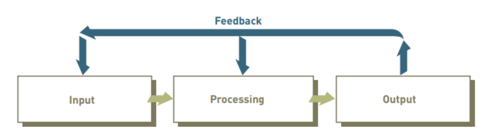
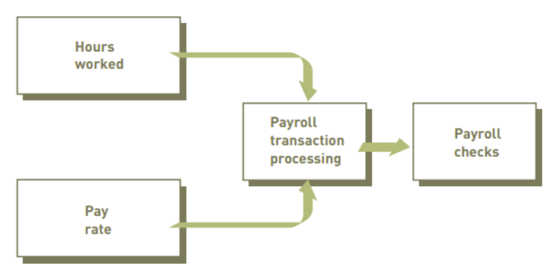
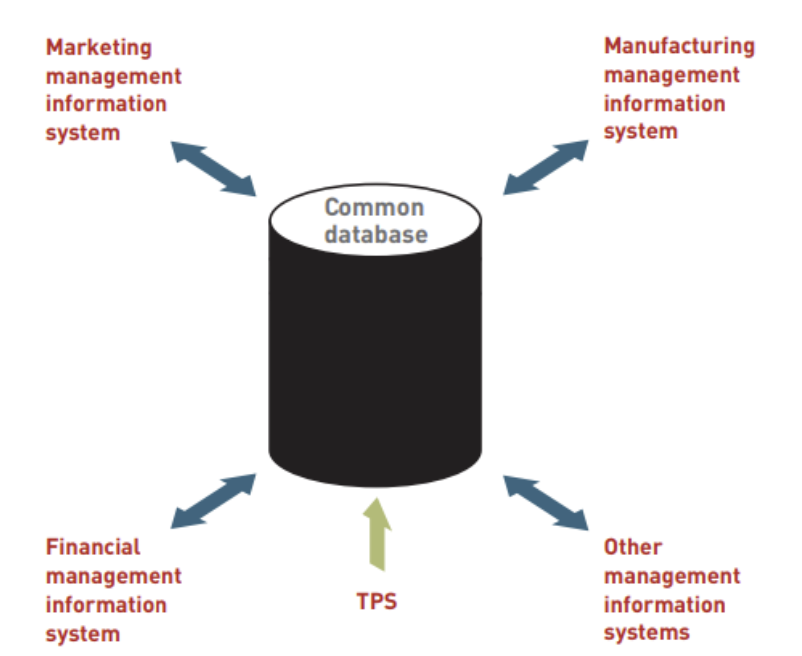
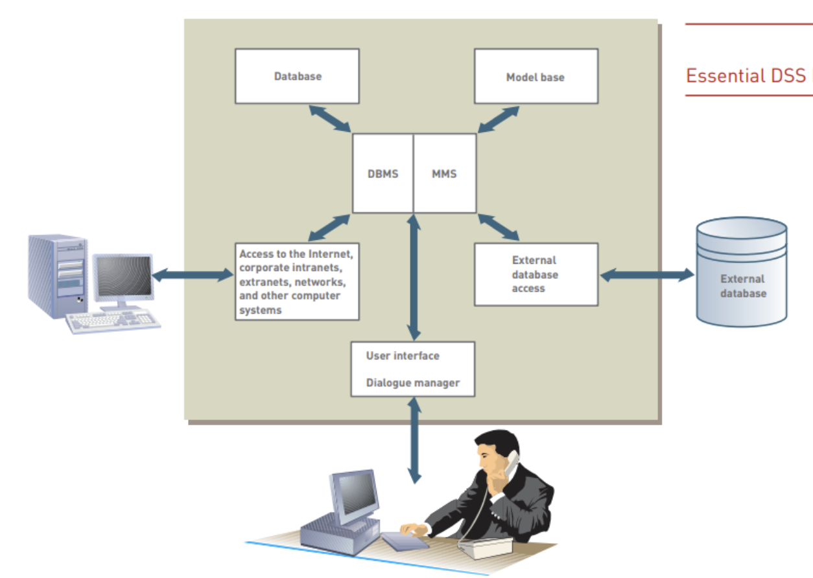
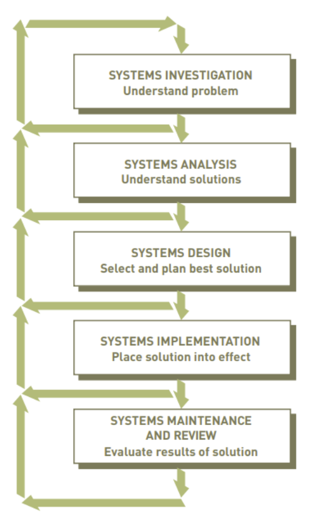

# Information System
An information system (IS) is a set of interrelated components that
collect (input), manipulate(process), store, and disseminate(output)
data and information and provide a corrective reaction (feedback
mechanism) to meet an objective.

## Element
- Data : raw material relating to facts, events, transactions etc.
- Information : Data + Meaning = Information ;  a collection of facts organized so that they have
additional value beyond the value of the individual facts.
  - Characteristics of Good information :
    1. Accuracy : 
    Information should be correct and free from errors. Accurate information ensures that decisions based on it are sound.
    2. Relevance :
    The information must be pertinent to the context or situation at hand. Irrelevant information can lead to confusion and poor decision-making.
    3. Timeliness :
    Information should be up-to-date and available when needed. Timely information allows for swift responses and actions.
    4. Completeness :
    It should provide a full picture without missing key details. Incomplete information can lead to misunderstandings or poor outcomes.
    5. Consistency :
    Good information should not contradict itself and should align with other credible sources. Consistency builds trust in the data.
    6. Clarity :
    Information should be presented clearly and understandably. Ambiguity can lead to misinterpretation.
    7. Accessibility :
    Valuable information should be easy to access and understand. Information that is difficult to obtain or comprehend may not be used effectively.
    8. Objectivity :
    Information should be presented without bias. Objective information allows for fair analysis and decision-making.
    9.  Usability :
    It should be in a format that is easy to use and apply. Usable information is actionable and can lead to effective decisions.
    10. Source Credibility :
    The information should come from a reliable and reputable source. Credible sources enhance trust in the information provided.

- Knowledge : the awareness and understanding of a set of information and the ways that information can be made useful to support a specific task or reach a decision.
- Decision
- Action : Information + Decision = Action

## Architecture

- Input : 
In information systems, input is the activity of gathering and capturing
raw data.
  - examples: 
    - the number of hours every employee works must be collected before paychecks can be calculated or printed. 
    - In a university grading system, instructors must submit student grades before a summary of grades for the semester or quarter can be compiled and sent to the students.

- Processing :
converting or transforming
data into useful outputs. Processing can involve making calculations,
comparing data and taking alternative actions, and storing data for
future use. Processing data into useful information is critical in
business settings.
  - examples :
    - A company processes sales data to calculate total revenue.
    - A retailer analyzes purchase and demographic data.
    - A warehouse processes stock level data.

- Output :
output involves producing useful information,
usually in the form of documents and reports. Outputs can include
  - paychecks for employees
  - reports for managers 
  - information
supplied to stockholders, banks, government agencies, etc
  - In some cases, output from one system can become input for
another. 
  - example : 
    - output from a system that processes sales
  orders can be used as input to a customer billing system.

Feedback :
feedback is information from the system that
is used to make changes to input or processing activities. 
  - example : 
    - errors or problems might make it necessary to correct input data or change a process.
    - a furniture maker could use a computerized feedback system to link its suppliers and plants.
  

## Functions of Management
- Planning: Short and long term – setting goals
- Organising: Deciding how to use resources
- Directing: Guiding employees to support the organisational goals
- Controlling: Monitoring organisation’s goals
## System
### CBIS
A computer-based information system (CBIS) is a single set of
hardware, software, databases, telecommunications, people, and
procedures that are configured to collect, manipulate, store, and
process data into information.
### TPS
Transaction processing system an organized collection of
people, procedures, software, databases, and devices used to record
completed business transactions.

### MIS
- Management Information Systems is organized collection of
people, procedures, software, databases, and devices that provides
routine information to managers and decision makers.
- focuses on operational efficiency.
- Marketing, production, finance, and other functional areas are
supported by MISs and linked through a common database. 

### DSS
- Decision Support Systems is an organized collection of people,
procedures, software, databases, and devices that support problem-specific decision making.

#### DBMS
A Database Management System (DBMS) is software that allows users to define, create, maintain, and control access to databases. 
- Data Organization: DBMS organizes data into tables, allowing for easy access and modifications.
- Data Integrity: Ensures accuracy and consistency of data through constraints and rules.
- Data Security: Provides mechanisms to control access and protect sensitive information.
- Concurrency Control: Manages simultaneous access to the database by multiple users.
- Backup and Recovery: Offers tools for data backup and restoration in case of failures.

#### MSS
A Model Management System (MMS) is a specialized framework or software solution designed to store, organize, manage, and version various models used in different domains.

- Model Versioning
  - Tracking Changes: MMS allows users to keep track of different versions of models, making it easy to revert to previous versions or compare changes over time.
- Collaboration
  - Team Workflows: Facilitates collaboration among team members by providing tools for sharing, reviewing, and co-developing models.
- Central Repository
  - Storage: Acts as a centralized storage solution for models, ensuring that all team members have access to the latest versions and can manage dependencies effectively.
- Integration with Tools
  - Ecosystem Compatibility: Often integrates with other tools used in the development process, such as version control systems, CI/CD pipelines, and cloud platforms.
- Model Deployment
  - Production Readiness: Helps streamline the deployment of models into production environments, often including monitoring and management features.
- Documentation and Metadata Management
  - Context and Usage: Maintains metadata related to models, including descriptions, usage guidelines, and performance metrics, which is crucial for understanding and using models effectively.
- Compliance and Governance
  - Regulatory Compliance: Ensures that models adhere to organizational standards and regulatory requirements, facilitating audits and compliance checks.

### MIS vs DSS
Whereas an MIS helps an organization “do things right,” a DSS helps a manager “do the right thing.”

## System Developement

- Systems investigation : to gain a clear understanding of the problem to be solved or opportunity to be addressed.
- Systems analysis : defines the problems and opportunities of the existing system
- Systems design :
determines how the new system will work to meet
the business needs defined during systems analysis.
- Systems implementation : 
involves creating or acquiring the various system components (hardware, software, databases, etc.) defined in the design step, assembling them, and putting the new system into operation.
- Systems maintenance and review : to check and
modify the system so that it continues to meet changing business needs. Increasingly, companies are hiring outside companies to do their design, implementation, maintenance, and review functions.

## Outsourcing
- People inside a company can develop systems, or companies can use outsourcing, hiring an outside company to perform some or all of a systems development project.
- Outsourcing allows a company to focus on what it does best and delegate other functions to companies with expertise in systems development. Outsourcing, however, is not the best alternative for all companies.