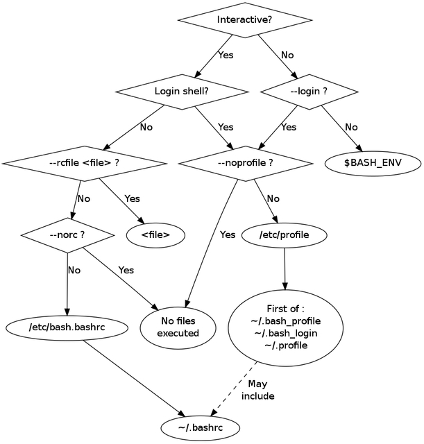

# Terminal

## Command

## tools
- watch
  - MacOS Install : `brew install watch`
  - Run per min : `watch -n 1 "date '+%Y-%m-%d %H:%M:%S'"`
### Common
- Make directory if exists with no error : `mkdir -p ./bin/`
- Move directory(all content) to path : `mv /path/to/source/folder /path/to/destination`
- Rename file :  `mv oldFile newFile`

## Shell

### VI

- Delete Line : `dd`
- Go First Line : `gg`
- Start Select: `v`
- Start Select Line : <kbd>Shift</kbd> + `v`
- Go First Line : <kbd>Shift</kbd> + `g`

### Bash
- Difference of bash profiles : [Stack Overflow](https://stackoverflow.com/questions/18791486/differences-uses-and-similarities-between-bashrc-bash-profile-and-etc-profil) 

### ZSH
- Difference of zsh profiles : [FreeCodeCamp](https://www.freecodecamp.org/news/how-do-zsh-configuration-files-work/)  

### Powershell

