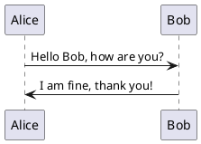
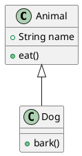
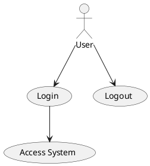
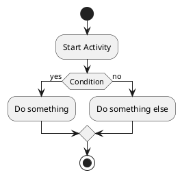
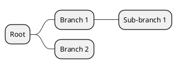

# UML

## Install
- VSCode Extension : `jebbs.plantuml`
- Extension Setting : `plantuml.server` : `https://www.plantuml.com/plantuml`
- Java Runtime : 
  - `brew install openjdk`
  - `brew info openjdk`
  - `echo 'export PATH="/opt/homebrew/opt/openjdk/bin:$PATH"' >> /Users/leolau/.zshrc`
- Close and Open VSCode
- Open Preview on .puml file : <kbd>Opt</kbd> + <kbd>D</kbd> 
- (Optional) Dot Tool from Graphviz : `brew install graphviz`

## Syntax

PlantUML uses a simple and intuitive syntax to create various types of diagrams. Here's a brief introduction to the basic syntax for some common diagram types:

## PlantUML

### 1. **Sequence Diagram**

### 2. **Class Diagram**

### 3. **Use Case Diagram**

### 4. **Activity Diagram**

### 5. **Mind Map**

### General Structure

- **Start/End:** Each diagram begins with `@startuml` and ends with `@enduml`.
- **Elements:** Elements of the diagram (e.g., classes, actors, activities) are defined using keywords and indentation.
- **Arrows:** Relationships or flows are represented using arrows (`->`, `<-`, etc.).

- Ref link : [PlantUML Documentation](https://plantuml.com/)

## Tips
Init : `example/hello_world.puml`

