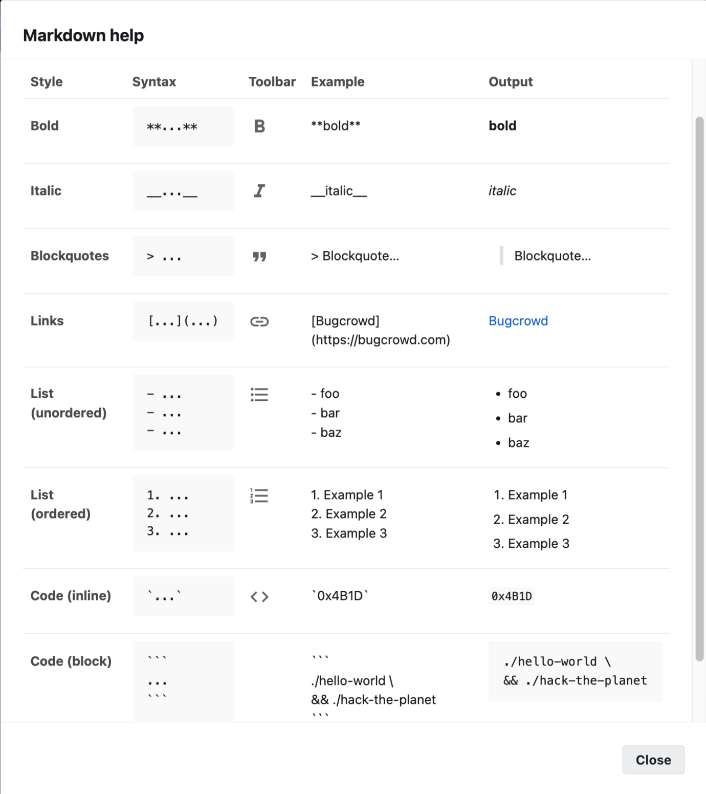

# Markdown


## Visual Studio Code

### Useful Links

[Cheat Sheet](https://www.markdownguide.org/cheat-sheet)

[Showcase](https://demo.flatnotes.io/note/Markdown%20Showcase)


### Extension
yzhang.markdown-all-in-one

### Visual Studio Code Hotkeys 

- Show Preview <kbd>Ctrl</kbd> + <kbd>Shift</kbd> + <kbd>V</kbd>


## Basic 



## List

- \* \+ \- have no difference, you can use for indicating level :
  ```
  * Item 1
    + Item 2
      - Item 3
    + Item 4
  * Item 4
    + Item 5
  ```
## Checkbox
- [x] Mars
- [ ] Jupiter

## Table
| Header 1 | Header 2 |
|----------|----------|
| Row 1    | Data 1   |
| Row 2    | Data 2   |
| Row 3    | Data 3   |


## Other

\<kbd>Ctrl\</kbd> + \<kbd>Alt\</kbd> + \<kbd>Space\</kbd>
<kbd>Ctrl</kbd> + <kbd>Alt</kbd> + <kbd>Space</kbd>


