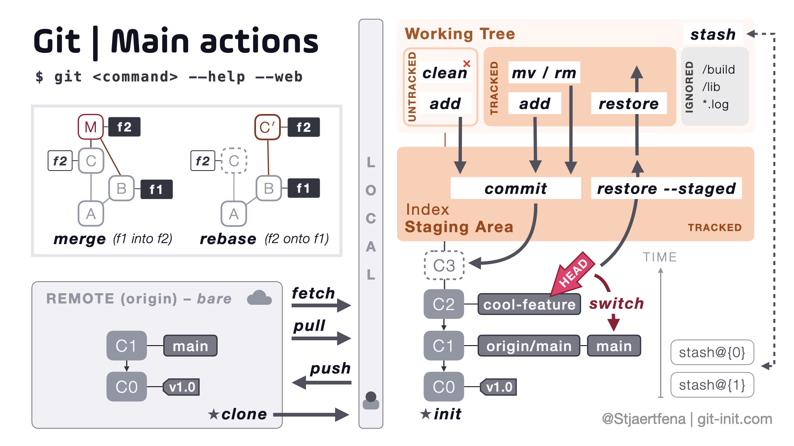
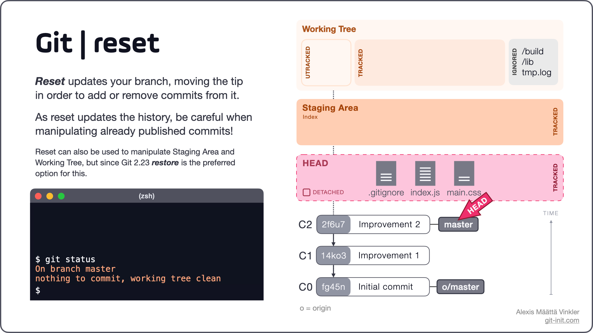
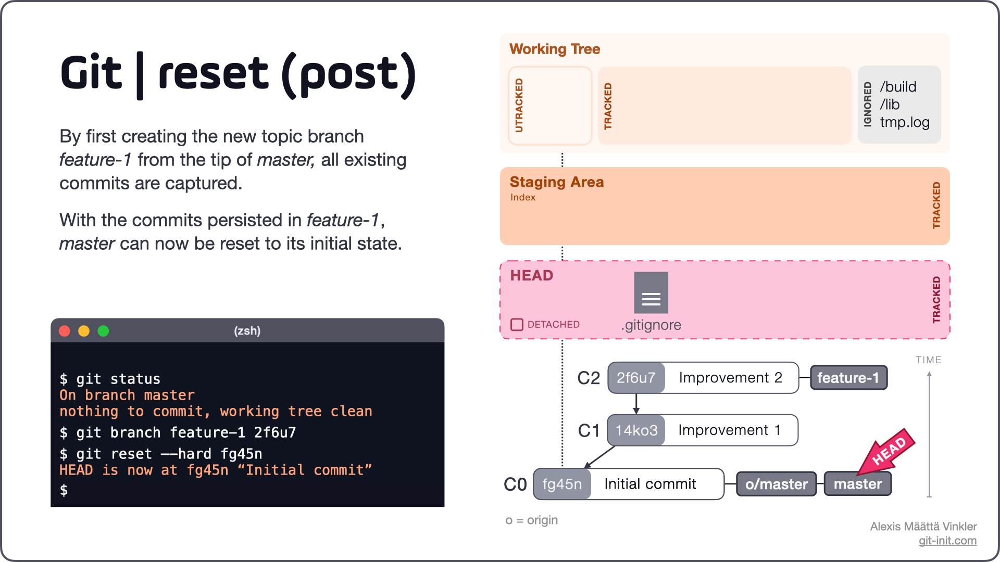
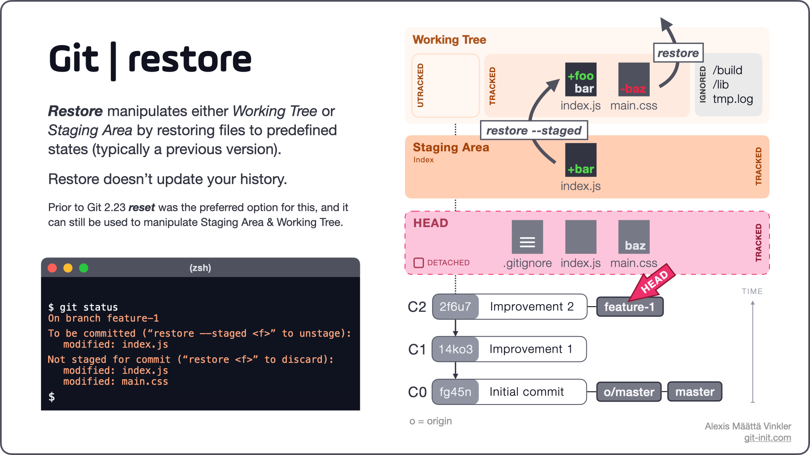
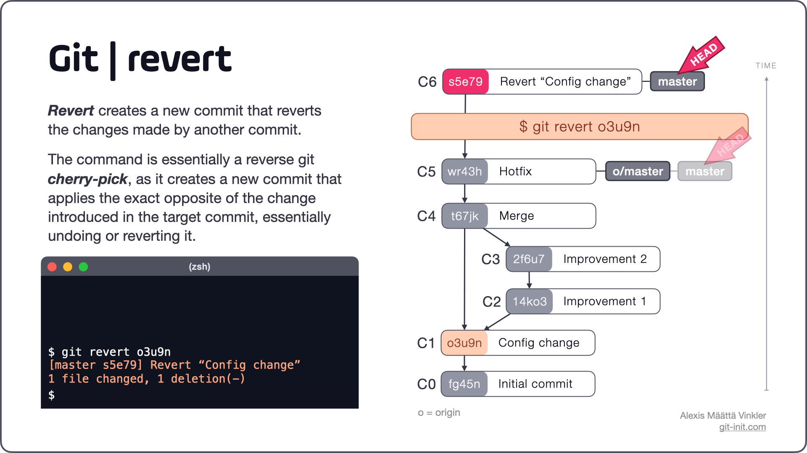
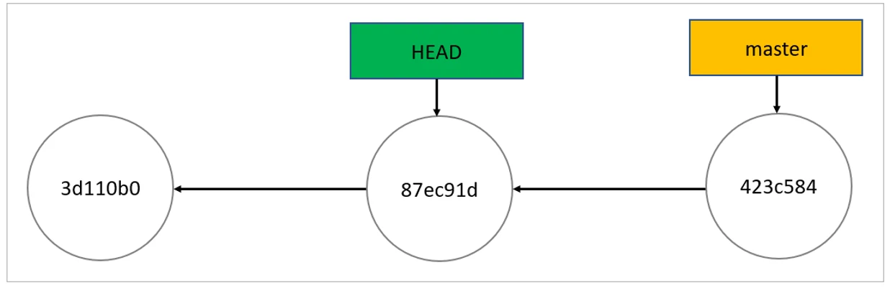
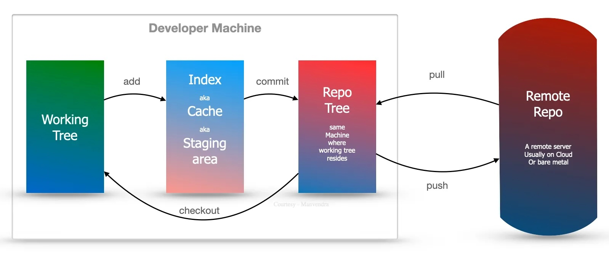

# Visual Studio Code

## Learn
[Learn Git Branching](https://learngitbranching.js.org/)

## Blog
[Pragmatic Git](https://blog.git-init.com/)

## Overview


## Install
- Windows : 
    - Git : `winget install --id Git.Git -e --source winget`
    - Github CLI : `winget install --id=GitHub.cli  -e`
- MacOS : 
    - Git : `brew install git`
    - Github CLI : `brew install gh`     
- Linux:
  - Git: `sudo apt install git` (Debian-based)
  - GitHub CLI: `sudo apt install gh` (Debian-based)

## Setup
- Login :
    ```
    gh auth login
    gh auth setup-git
    ```
- Profile :
    ```
    git config --global user.email "asuralhp@gmail.com"
    git config --global user.name "asuralhp"
    ```
- Clone : `git clone https://github.com/libgit2/libgit2`
  - Recursive : `git clone --recursive --shallow-submodules https://github.com/libgit2/libgit2`
- Initialization (Optional if Repo exits): 
    ```
    git init
    git add -A
    git commit -m "Init"
    git branch -M main
    ```


## Read
- Check Status : `git status`
- Commit Log One Line : `git log --oneline`
- All Log ADOG : `git log --all --decorate --oneline --graph`
- All Branch : `git branch -a`
- All Remote : `git remote -v`
- Configuration : `git config --list`
  - Show Origin : `git config --list --show-origin`

## Reverse
- Uncommit Last : `git reset --soft HEAD^`
- Unstage File
  - If you want to keep your changes in your working directory but unstage them: `git reset <commit_hash>`
  - `--soft` : If you want to keep your changes staged (in the index) but move the HEAD to a previous commit
  - `--hard` : If you want to keep your changes in your working directory but unstage them
  - 
  - 
- Unstage All: `git restore --staged`
  - 
- Commit to Reset: `git revert`
  - 

## TroubleShoot
### Detached head 

> it means you are no longer on a branch, you have checked out a single commit in the history (in this case the commit previous to HEAD, i.e. HEAD^).

#### If you want to keep your changes associated with the detached HEAD
1. Run `git branch tmp` - this will save your changes in a new branch called tmp.
2. Run `git checkout master`
3. If you would like to incorporate the changes you made into `master`, run `git merge tmp` from the `master` branch. You should be on the `master` branch after running `git checkout master`.

#### If you want to delete your changes associated with the detached HEAD
1. You only need to checkout the branch you were on, e.g. `git checkout master`

#### Want to restore it in working directory to the state it is in the index, don't delete the file, just do
1. `git checkout -- path/to/foo`


## Structure
- 

## Useful Links
- [Git Branching Visual Learning](https://pcottle.github.io/learnGitBranching/)

## Github
- Limit : 
  Product                    | Maximum file size
  ---------------------------|------------------:
  GitHub Free                |            2 GB
  GitHub Pro                 |            2 GB
  GitHub Team                |            4 GB
  GitHub Enterprise Cloud    |            5 GB