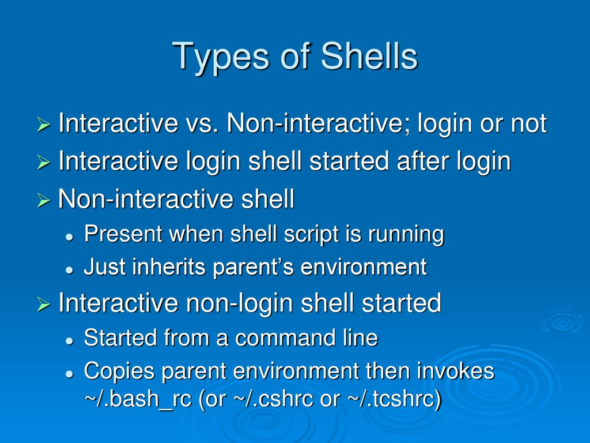
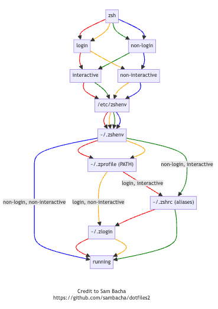

# Terminal

## Command

### Common
- Make directory if exists with no error : `mkdir -p ./bin/`
- Move directory(all content) to path : `mv /path/to/source/folder /path/to/destination`
- Rename file :  `mv oldFile newFile`

## Shell

### Bash
- Difference of bash profiles : [Stack Overflow](https://stackoverflow.com/questions/18791486/differences-uses-and-similarities-between-bashrc-bash-profile-and-etc-profil) 

### ZSH
- Difference of zsh profiles : [FreeCodeCamp](https://www.freecodecamp.org/news/how-do-zsh-configuration-files-work/)  

### Powershell
