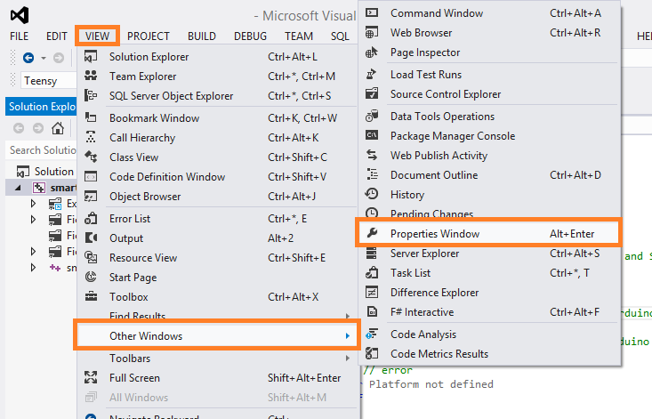

# Visual Studio

## Hotkeys
  - Save All Files :  <kbd>Ctrl</kbd> +  <kbd>Shift</kbd> + <kbd>S</kbd> 
  - Debug : <kbd>F5</kbd>
  - Compile active source file : <kbd>Ctrl</kbd> +  <kbd>F7</kbd>
  - Comment :  <kbd>Ctrl</kbd> +  <kbd>K</kbd> , <kbd>C</kbd>
  - Uncomment :  <kbd>Ctrl</kbd> +  <kbd>K</kbd> , <kbd>U</kbd>
  - Navigate Backwards :  <kbd>Ctrl</kbd> +  <kbd>-</kbd> 
  - Navigate Forwards :  <kbd>Ctrl</kbd> +  <kbd>Shift</kbd> + <kbd>-</kbd> 

## Setup
  - Install : `winget install --id=Microsoft.VisualStudio.2022.Community.Preview  -e`

## UI

- Properties Window : 
  

## CPP Config
  - Solution > Properties
    - Include : `C++ -> General -> Additional Include Directories` and press `<Edit...>` in the dropdown box.
    - Library : `Linker -> General -> Additional Library Directories` press `<Edit...>` in the dropdown box.
    - Linker :` Linker -> Input -> Additional Dependencies` in the  press `<Edit...>` dropdown box.